[![Issues][issues-shield]][issues-url]
[![LinkedIn][linkedin-shield]][linkedin-url]

<!-- Intro -->
<br />
<div align="center" style="text-align:center;">
  </img>
  <h1>Oracle Database 23ai<br/>+Vector Search</h1>
  <table align="center">
    <tr style="font-size:medium;">
      <td colspan="3">Oracle Cloud</td>
      <td colspan="4">GPU & Frameworks</td>
    </tr>
    <tr align="center">
      <td></td>
      <td></td>
      <td></td>
      <td></td>
      <td></td>
      <td></td>
      <td></td>
    </tr>
    <tr style="font-size:small;">
      <td>Generative AI</td>
      <td>Autonomous 23ai</td>
      <td>VM Chatbot</td>
      <td>NVIDIA</td>
      <td>Cohere</td>
      <td>LangChain</td>
      <td>Streamlit</td>
    </tr>
  </table>
  <br/>
  <h3>Building Data Architecture For AI/ML</h3>
  <a style="font-size:large;" href="/src/">👨🏽‍💻 Explore the Code »</a>
  <br/>
  <a href="https://www.youtube.com/watch?v=6L1YmTRZNxM&list=PLMUWTQHw13gbk738EGtr0fWwi40B81qEw">🎬 View Demo</a>
  ·
  <a href="https://github.com/jganggini/oci-functions/issues">💣 Report Bug</a>
  ·
  <a href="https://github.com/jganggini/oci-functions/pulls">🚀 Request Feature</a>
</div>

<!-- Content -->
<details>
  <summary>Content</summary>
  <ol>
    <li><a href="#use-case">Use Case</a></li>
    <li><a href="#description">Description</a></li>
    <li>
        <a href="#steps">Steps</a>
        <ul>
            <li><a href="#policies">Policies</a></li>
            <li><a href="#generative-ai">Generative AI</a></li>
            <li><a href="#autonomous-database-23ai">Autonomous Database 23ai</a></li>
            <li><a href="#api-key">API key</a></li>
            <li><a href="#virtual-cloud-networks">Virtual Cloud Networks</a></li>
            <li><a href="#virtual-machine">Virtual Machine</a></li>
        </ul>
    </li>
    <li><a href="#references">References</a></li>
    <li><a href="#contact">Contact</a></li>
  </ol>
</details>

# Use Case

Se necesita una solución para gestionar y analizar información de clientes de manera eficiente y segura, utilizando bases de datos avanzadas y capacidades de inteligencia artificial para realizar análisis detallados y personalización en tiempo real. Esto permitirá automatizar la generación de informes, mejorar el control de acceso a información sensible, y facilitar interacciones personalizadas con los clientes mediante sistemas inteligentes, todo en un entorno escalable y capaz de integrar diversas fuentes de datos.

# Description

<p align="center">
  Building Data Architecture For AI
  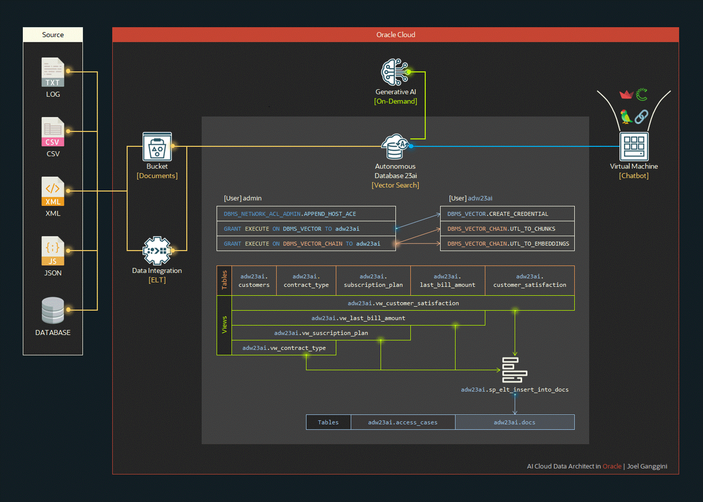
</p>

La base de datos Autonomous Database 23AI cuenta con diversos paquetes, a continuación, se presentan descripciones de algunos usados para atender el caso:
* `DBMS_NETWORK_ACL_ADMIN`: Administra listas de control de acceso de red.
* `DBMS_VECTOR`: Proporciona herramientas para la creación y manipulación de datos vectoriales, facilitando tareas de machine learning y análisis de similitud.
* `DBMS_VECTOR_CHAIN`: Facilita la creación, transformación, y manipulación de cadenas de vectores, mejorando el procesamiento y almacenamiento eficiente de datos multidimensionales en Oracle Database.

<a href="https://youtube.com/playlist?list=PLMUWTQHw13gbk738EGtr0fWwi40B81qEw&si=aHJHPmp_Ppr99tCO">[View More (+)]</a>

La base de datos utiliza varias tablas y vistas para gestionar y analizar la información de los clientes. Las principales tablas del modelo son:

* `adw23ai.customers`: Contiene información básica de los clientes.
* `adw23ai.subscription_plan`: Registra los detalles de los planes de suscripción.
* `adw23ai.contract_type`: Define los tipos de contratos disponibles.
* `adw23ai.last_bill_amount`: Almacena los montos de las últimas facturas.
* `adw23ai.customer_satisfaction`: Captura los datos sobre la satisfacción del cliente.

Estas tablas generan las siguientes vistas para un análisis más detallado y para facilitar la generación de embeddings:

* ``adw23ai.vw_customer_satisfaction`
* ``adw23ai.vw_last_bill_amount`
* ``adw23ai.vw_suscription_plan`
* ``adw23ai.vw_contract_type`

El procedimiento almacenado `adw23ai.sp_elt_insert_into_docs`, se encarga de generar y almacenar embeddings a partir de los datos procesados en estas vistas. Estos embeddings se almacenan en la tabla adw23ai.docs, la cual es utilizada por un chatbot para interactuar con los datos. Adicionalmente, la tabla adw23ai.access_cases, se emplea para restringir el acceso a la información.

# Steps

## Policies

  Ingresar a `Identity` ➡️ `Policies` ➡️ `Create Policy`

  Crear `Policies` para `GenerativeAI`

  ```sql
  Allow any-user to use generative-ai-family in compartment <Compartment-Name>
  ```
  <h5>🚨 Las políticas se aplicarón a todos los usuarios del tenant (any-usear) por ser una demo.</h5>

## Generative AI
    
  Ingresar a `Generative AI` ➡️ `Embedding`

  Copiar el `Name` modelo para generar embeddings `[cohere.embed-multilingual-v3.0]` en el stored procedure [sp_elt_insert_into_docs](src/a-virtual-machine/www/autonomous.database.23ai.generative.ai/plsql/developer/1.user/d.CREATE_SP_ELT_INSERT_INTO_DOCS.sql) que generara los embeddings desde `Autonomous Database 23ai` de forma dinamica.

  <p align="center">
    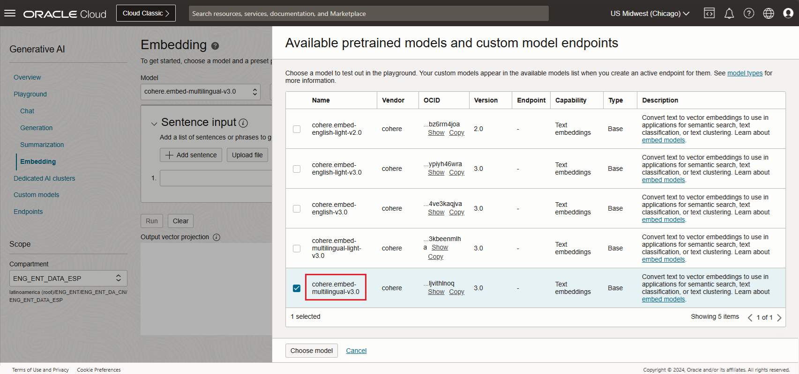
  </p>

  <p align="center">
    Stored Procedure Structure
    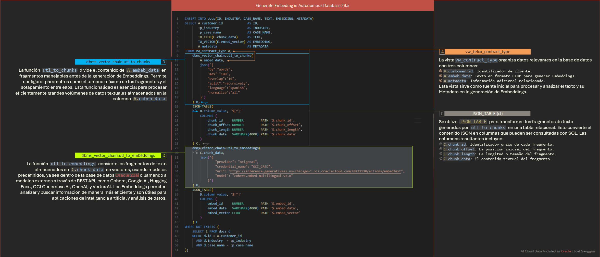
  </p>

## Autonomous Database 23ai

  Ingresar a `Autonomous Database` ➡️ `Autonomous Databases` ➡️ `Create Autonomous Database`

  1️⃣ Create Autonomous Database
  - Name: `adw23ai`
  - Choose database version: `23ai`
  - ECPU coun: `8`

  <p align="center">
      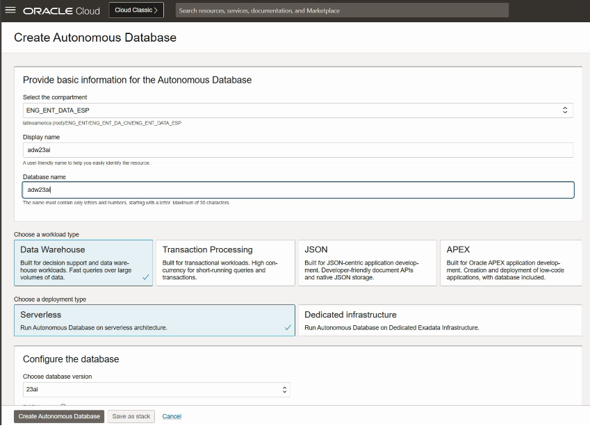
  </p>

## API key

  Ingresar a `Identity` ➡️ `My profile` ➡️ `API Keys`

  Seleccionar `Add API Key`, luego seleccionar `Download private key`.
  Se mostrara una ventana `Configuration file preview`, guardar para generar el archivo [config](src/a-virtual-machine/Users/opc/.oci/config) 

  <p align="center">
    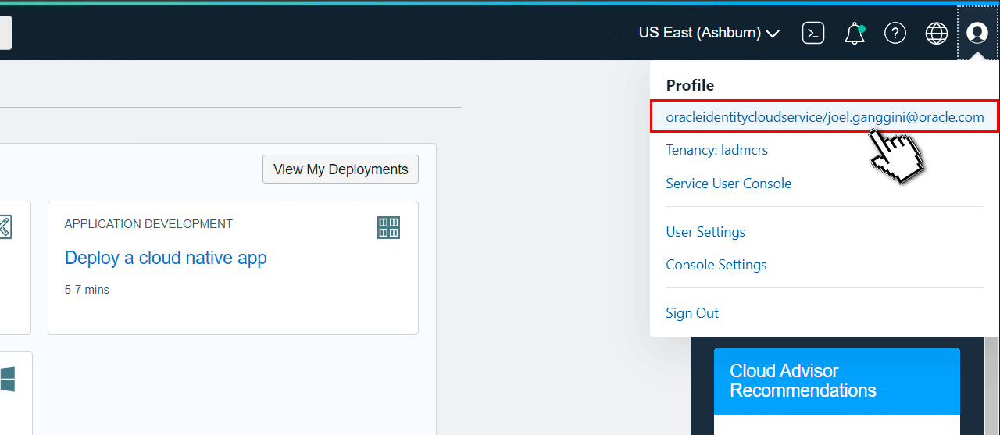
  </p>

## Virtual Cloud Networks

  Ingresar a `Networking` ➡️ `Virtual Cloud Networks` ➡️ `Start VCN Wizard`

  Crear una `VCN` con el `Wizard`, llamada `vcn-demo`.

  <p align="center">
    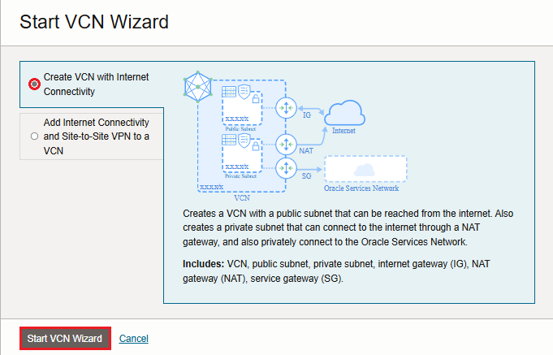
  </p>

  Ingresar a `Virtual Cloud Networks` ➡️ `vcn-demo` ➡️ `Security List Details` ➡️ `Default Security List for VCN`

  Agregar `Ingress Rules` los puertos `3389`/`3002`

  <p align="center">
    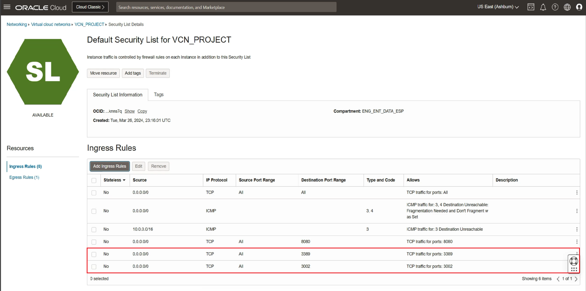
  </p>

## Virtual Machine

  Ingresar a `Compute` ➡️ `Instances` ➡️ `Create Instance`

  Crear la `Virtual Machines` para acceder a `OpenSource`.

  - Name: `instance-demo`
  - Image: `Windows Server 2022 Standard`
  - Shape: `VM.Standard.E4.Flex`
  - Primary network: `vcn-demo`
  - Subnet: `Public Subnet`

  Copiar la dirección IP de la `Virtual Machines` para acceder.

  Descargar [Nginx](https://nginx.org/en/download.html) e Instalar.

  Editar el archivo [nginx.conf](/src/a-virtual-machine/nginx-1.27.0/conf/nginx.conf) y agregar el server del `chatbot`.

  ```config
  server {
      listen       3002;
      server_name  localhost;

      location / {
          proxy_pass https://localhost:8502/;
          proxy_set_header Host $host;
          proxy_set_header X-Real-IP $remote_addr;
          proxy_set_header X-Forwarded-For $proxy_add_x_forwarded_for;
          proxy_set_header X-Forwarded-Proto $scheme;
      }

      error_page   500 502 503 504  /50x.html;
      location = /50x.html {
          root   html;
      }
  }
  ```

  Ingresar a `CMD` en modo administrador y reiniciar `Nginx`.

  ```cmd
  Microsoft Windows [Version 10.0.20348.2527]
  (c) Microsoft Corporation. All rights reserved.

  C:/Windows/system32>cd..
  C:/Windows>cd..
  C:/>cd nginx-1.27.0
  C:/nginx-1.27.0>nginx.exe
  ```

  Ingresar al Firewall de Windows y agregar el puerto `3002`.

  <p align="center">
    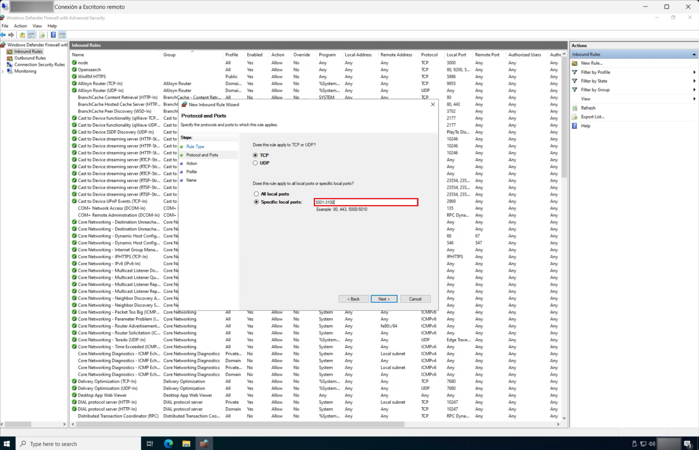
  </p>

  Ahora podremos ingresar a `Chatbot` de forma publica con la IP de la `Virtual Machine`.

  Descargar [Conda](https://conda.io/projects/conda/en/latest/user-guide/install/windows.html) e Instalar.

  Crear el directorio `C:/www/autonomous.database.23ai.generative.ai` y copiar [autonomous.database.23ai.generative.ai](src/a-virtual-machine/www/autonomous.database.23ai.generative.ai/).

  Descargar [Visual Studio Code](https://code.visualstudio.com/download) e Instalar.

  Ingresar a `Visual Studio Code`, abrir el proyecto y configurar las variables [.env](src/a-virtual-machine/www/autonomous.database.23ai.generative.ai/.env).

  <p align="center">
    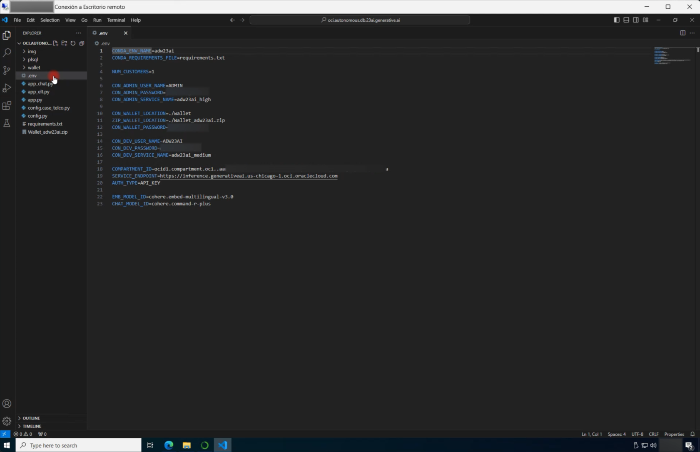
  </p>

  Abrir un terminal y ejecutar el comando `pip install oracledb` para instalar las dependencias en (base).

  <p align="center">
    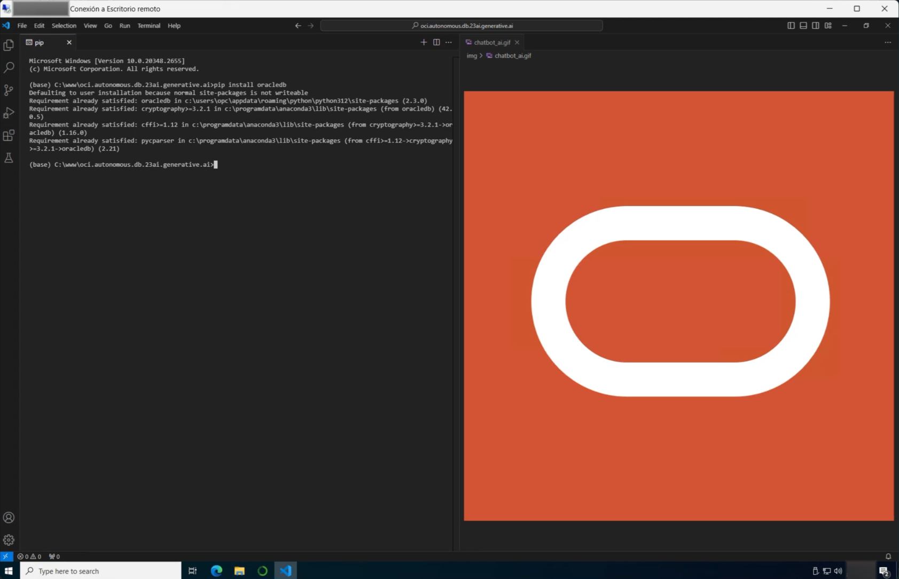
  </p>
  
  En el mismo terminal ejecutar el comando `python config.py`.

  <p align="center">
    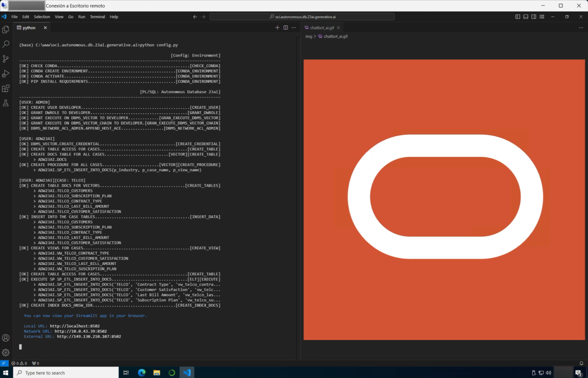
  </p>


# References

- [Oracle: Other Frameworks](https://accelerated-data-science.readthedocs.io/en/latest/user_guide/model_registration/frameworks/genericmodel.html)
- [PL/SQL Packages and Types Reference: DBMS_VECTOR](https://docs.oracle.com/en/database/oracle/oracle-database/23/arpls/dbms_vector1.html)
- [PL/SQL Packages and Types Reference: DBMS_VECTOR_CHAIN](https://docs.oracle.com/en/database/oracle/oracle-database/23/arpls/dbms_vector_chain1.html)
- [LangChain: langchain_community.embeddings.oci_generative_ai](https://api.python.langchain.com/en/latest/_modules/langchain_community/embeddings/oci_generative_ai.html)
- [LangChain: ChatOCIGenAI](https://python.langchain.com/v0.2/docs/integrations/chat/oci_generative_ai/)

# Contact
Project Link: [https://github.com/jganggini](https://github.com/jganggini)

<!-- MARKDOWN LINKS & IMAGES -->
<!-- https://www.markdownguide.org/basic-syntax/#reference-style-links -->
[issues-shield]: https://img.shields.io/github/issues/othneildrew/Best-README-Template.svg?style=for-the-badge
[issues-url]: https://github.com/jganggini/oci-functions/issues
[linkedin-shield]: https://img.shields.io/badge/-LinkedIn-black.svg?style=for-the-badge&logo=linkedin&colorB=555
[linkedin-url]: https://www.linkedin.com/in/jganggini/