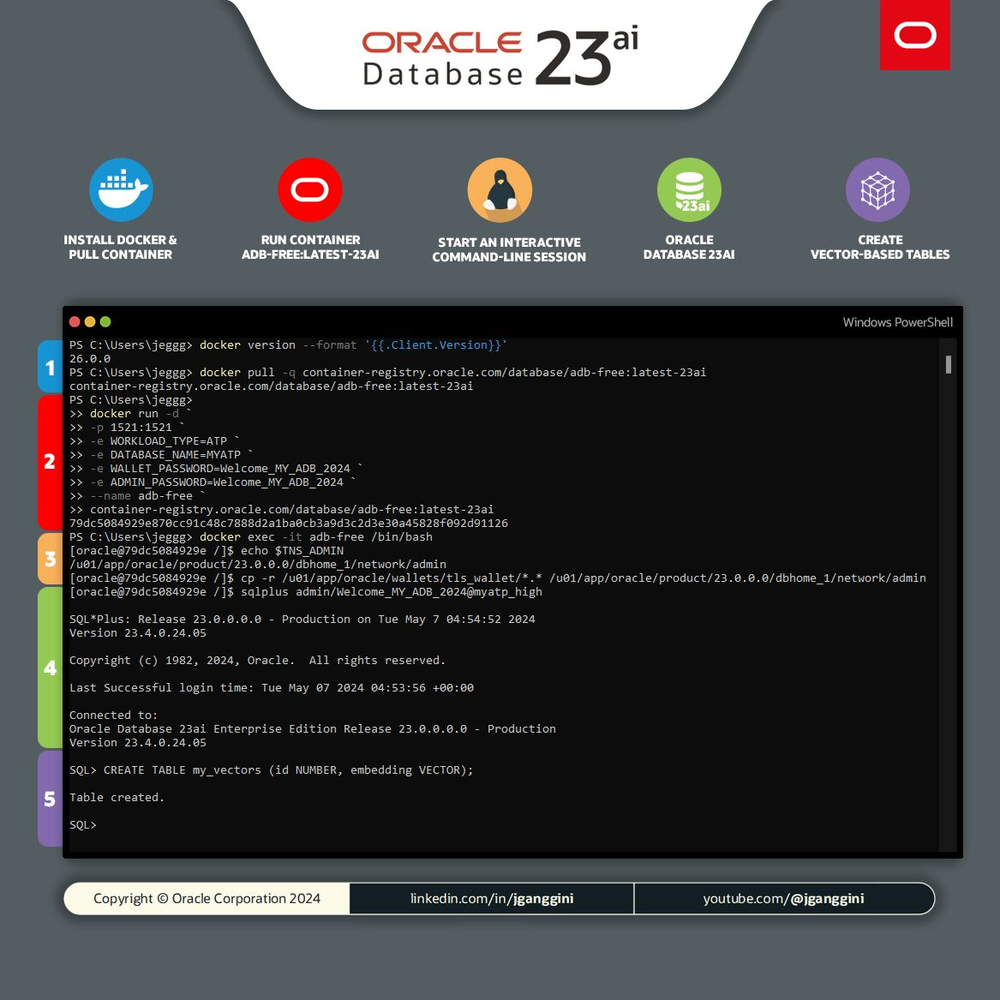

[![Issues][issues-shield]][issues-url]
[![LinkedIn][linkedin-shield]][linkedin-url]


<!-- PROJECT LOGO -->
<br />
<p align="center">

  <h2 align="center">Oracle Database 23ai Free</h3>

  <p align="center">
    <a href="https://youtube.com/@jganggini">🎬 View Demo</a>
    ·
    <a href="https://github.com/jganggini/oracle-ai/issues">Report Bug</a>
    ·
    <a href="https://github.com/jganggini/oracle-ai/pulls">Request Feature</a>
  </p>
</p>


## Introducción

Este documento proporciona los pasos para configurar y utilizar Oracle Database 23ai Free utilizando Docker en Windows PowerShell.



## Requisitos

1. Docker instalado en tu sistema.
2. Acceso a PowerShell en Windows.
3. Conexión a internet para descargar la imagen de Oracle Database.
4. Leer la [documentación de Oracle Database](https://container-registry.oracle.com/ords/f?p=113:10:8854846630398:::::) para obtener información detallada sobre las bases de datos disponibles, específicamente `adb-free`.

## Pasos para Configuración

### Paso 1: Instalar Docker y Descargar el Contenedor

1. Abre PowerShell y ejecuta el siguiente comando para verificar la versión de Docker:

    ```sh
    docker version --format '{{.Client.Version}}'
    ```

2. Ejecuta el siguiente comando para descargar la imagen de Oracle Database 23ai Free:

    ```sh
    docker pull container-registry.oracle.com/database/adb-free:latest-23ai
    ```

### Paso 2: Ejecutar el Contenedor

1. Una vez descargada la imagen, ejecuta el siguiente comando para iniciar el contenedor:

    ```sh
    docker run -d `
    -p 1521:1521 `
    -e WORKLOAD_TYPE=ATP `
    -e DATABASE_NAME=MYATP `
    -e WALLET_PASSWORD=Welcome_MY_ADB_2024 `
    -e ADMIN_PASSWORD=Welcome_MY_ADB_2024 `
    --name adb-free `
    container-registry.oracle.com/database/adb-free:latest-23ai
    ```

    **Notas:**
    - `-p 1521:1521` mapea el puerto 1521 del contenedor al puerto 1521 de tu host.
    - Las variables de entorno (`WORKLOAD_TYPE`, `DATABASE_NAME`, `WALLET_PASSWORD`, `ADMIN_PASSWORD`) configuran el entorno de la base de datos.

2. Opcional: Si necesitas reiniciar el contenedor, puedes usar el siguiente comando:

    ```sh
    docker start adb-free
    ```

### Paso 3: Iniciar una Sesión Interactiva en la Línea de Comandos

1. Ejecuta un shell interactivo dentro del contenedor:

    ```sh
    docker exec -it adb-free /bin/bash
    ```

2. Dentro del contenedor, verifica la variable `TNS_ADMIN`:

    ```sh
    echo $TNS_ADMIN
    ```

3. Consulta la documentación para más detalles: [Autonomous Database Serverless Documentation](https://docs.oracle.com/en-us/iaas/autonomous-database-serverless/doc/autonomous-docker-container.html#GUID-03B5601E-E15B-4ECC-9929-D06ACF576857)

4. Copia los archivos de wallet a la configuración de red de Oracle:

    ```sh
    cp -r /u01/app/oracle/wallets/tls_wallet/*.* /u01/app/oracle/product/23.0.0.0/dbhome_1/network/admin
    ```

### Paso 4: Conectarse a Oracle Database 23ai

1. Conéctate a SQL*Plus:

    ```sh
    sqlplus admin/Welcome_MY_ADB_2024@myatp_high
    ```

### Paso 5: Crear Tablas Basadas en Vectores

1. Crea una tabla para almacenar vectores:

    ```sql
    CREATE TABLE my_vectors (id NUMBER, embeding VECTOR);
    ```

## Conclusión

Siguiendo estos pasos, puedes configurar y utilizar Oracle Database 23ai Free en tu entorno de desarrollo utilizando Docker. Esta guía proporciona una configuración básica, y puedes consultar la documentación de Oracle para explorar más características y configuraciones avanzadas.


<!-- Contacto -->
## Contacto
Project Link: [https://github.com/jganggini](https://github.com/jganggini)

<!-- MARKDOWN LINKS & IMAGES -->
<!-- https://www.markdownguide.org/basic-syntax/#reference-style-links -->
[issues-shield]: https://img.shields.io/github/issues/othneildrew/Best-README-Template.svg?style=for-the-badge
[issues-url]: https://github.com/jganggini/oci-functions/issues
[linkedin-shield]: https://img.shields.io/badge/-LinkedIn-black.svg?style=for-the-badge&logo=linkedin&colorB=555
[linkedin-url]: https://www.linkedin.com/in/jganggini/