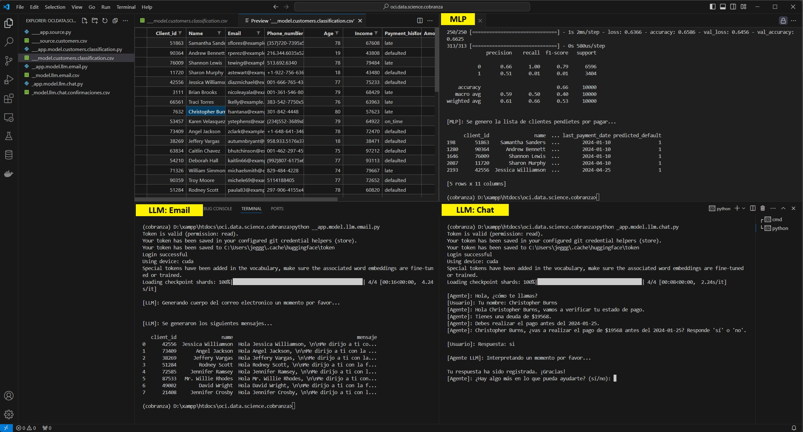

[![Issues][issues-shield]][issues-url]
[![LinkedIn][linkedin-shield]][linkedin-url]


<!-- PROJECT LOGO -->
<br />
<p align="center">

  <h2 align="center">OCI Data Science</h3>

  <p align="center">
    Solución de Cobranza Inteligente
    <br />
    <a href="./src"><strong>Explore the code »</strong></a>
    <br />
    <br />
    <a href="https://youtube.com/@jganggini">🎬 View Demo</a>
    ·
    <a href="https://github.com/jganggini/oracle-ai/issues">Report Bug</a>
    ·
    <a href="https://github.com/jganggini/oracle-ai/pulls">Request Feature</a>
  </p>
</p>

## Introducción

Este proyecto tiene como objetivo desarrollar una solución que mejore el proceso de cobranza utilizando inteligencia artificial y técnicas de aprendizaje automático. Nos enfocaremos en identificar clientes morosos, segmentarlos y generar estrategias de cobranza personalizadas. A continuación, se detallan los pasos para configurar el entorno y ejecutar el proyecto.



## Requisitos Previos

1. Una cuenta en OCI (Oracle Cloud Infrastructure) con acceso a OCI Data Science.
2. Un entorno de desarrollo configurado con Jupyter Notebook.
3. Conocimientos básicos de Python, aprendizaje automático y técnicas de IA generativa.

## Configuración del Entorno

### Paso 0: Crear y Activar un Entorno Conda

```sh
conda create --name cobranza python=3.9
conda activate cobranza
pip install --upgrade pip
```

### Paso 1: Generar Clientes y Datos Aleatorios

1. Instalar las bibliotecas necesarias:

    ```sh
    pip install pandas
    pip install numpy
    pip install faker
    ```

    **Descripción de las librerías:**
    
    - **pandas:** Es una librería fundamental para la manipulación y el análisis de datos. Permite manejar estructuras de datos como DataFrames de manera eficiente.
    - **numpy:** Es una librería esencial para el cálculo numérico en Python. Proporciona soporte para arrays y matrices multidimensionales, junto con una colección de funciones matemáticas de alto nivel para operar con estos arrays.
    - **faker:** Es una librería que permite generar datos falsos de forma rápida y sencilla. Se utiliza para crear datos de prueba como nombres, direcciones, correos electrónicos, etc.

2. Ejecutar el script para generar datos aleatorios de clientes:

    ```sh
    python ____app.source.py
    ```

    El script generará un archivo CSV llamado `____source.customers.csv`.

### Paso 2: Clasificación Neuronal con TensorFlow

1. Instalar TensorFlow y Scikit-learn:

    ```sh
    pip install tensorflow
    pip install scikit-learn
    ```

    **Descripción de las librerías:**

    - **tensorflow:** Es una librería de código abierto para el aprendizaje automático desarrollada por Google. Permite construir y entrenar modelos de aprendizaje profundo.
    - **scikit-learn:** Es una librería para aprendizaje automático en Python. Proporciona herramientas simples y eficientes para el análisis de datos y el modelado predictivo.

2. Ejecutar el script de clasificación de clientes:

    ```sh
    python __app.model.customers.classification.py
    ```

    Este script generará un archivo CSV con las clasificaciones: `__model.customers.classification.csv`.

### Paso 3: Configuración de GPU

1. Instalar PyTorch y herramientas CUDA:

    ```sh
    conda install pytorch torchvision torchaudio cudatoolkit=11.7 -c pytorch -c nvidia
    ```

    **Descripción de las librerías:**

    - **pytorch:** Es una librería de aprendizaje automático desarrollada por Facebook. Es conocida por su flexibilidad y facilidad de uso, especialmente en el desarrollo de modelos de aprendizaje profundo.
    - **torchvision:** Contiene conjuntos de datos, modelos y transformaciones específicas para visión por computadora.
    - **torchaudio:** Proporciona conjuntos de datos, transformaciones y modelos para el procesamiento de audio.
    - **cudatoolkit:** Incluye herramientas para desarrollar aplicaciones de cómputo en paralelo usando GPUs NVIDIA.

2. Verificar la disponibilidad de CUDA:

    ```sh
    python -c "import torch; print('CUDA available:', torch.cuda.is_available())"
    ```

3. Instalar Git y configurar credenciales:

    ```sh
    conda install git
    git config --global credential.helper store
    ```

    **Descripción de las herramientas:**

    - **git:** Es un sistema de control de versiones distribuido, utilizado para rastrear cambios en el código fuente durante el desarrollo del software.

### Paso 4: Implementación de Modelos de Lenguaje Natural (LLM)

#### ¿Qué es Hugging Face?

Hugging Face es una plataforma líder en el desarrollo de modelos de inteligencia artificial, especialmente en el campo del procesamiento de lenguaje natural (NLP). Ofrece una amplia biblioteca de modelos preentrenados que pueden ser utilizados y personalizados para diversas tareas de NLP como clasificación de texto, generación de texto, traducción, entre otras.

Para utilizar los modelos de Hugging Face, primero necesitas crear una cuenta en [Hugging Face](https://huggingface.co/), obtener un token de acceso y luego usar este token para autenticarte y acceder a los modelos.

1. Crear una cuenta y obtener un token de acceso:
    - Regístrate en [Hugging Face](https://huggingface.co/join).
    - Una vez registrado, ve a la configuración de tu cuenta y genera un token de acceso en [https://huggingface.co/settings/tokens](https://huggingface.co/settings/tokens).

2. Instalar bibliotecas necesarias:

    ```sh
    pip install chardet
    pip install torch transformers
    ```

    **Descripción de las librerías:**

    - **chardet:** Es una librería para detectar el encoding de archivos de texto.
    - **transformers:** Es una librería de Hugging Face que proporciona modelos y herramientas para el procesamiento de lenguaje natural. Facilita el uso y la implementación de modelos preentrenados como BERT, GPT-3, y muchos otros.

3. Autenticar con Hugging Face usando tu token:

    ```python
    from huggingface_hub import login
    login("tu_token_de_hugging_face")
    ```

#### Uso de los Archivos .py

A continuación se describe cómo utilizar cada uno de los archivos .py proporcionados.

1. **Generación de Datos de Clientes:**

    Ejecuta `____app.source.py` para generar datos de clientes ficticios. Este script utiliza bibliotecas como `pandas`, `numpy` y `faker` para crear un conjunto de datos simulado que se guardará en `____source.customers.csv`.

    ```sh
    python ____app.source.py
    ```

2. **Clasificación de Clientes:**

    Ejecuta `__app.model.customers.classification.py` para clasificar los clientes utilizando un modelo de red neuronal. Este script cargará los datos generados previamente, entrenará un modelo de clasificación y guardará los resultados en `__model.customers.classification.csv`.

    ```sh
    python __app.model.customers.classification.py
    ```

3. **Modelo de Email de LLM:**

    Ejecuta `__app.model.llm.email.py` para generar estrategias de cobranza personalizadas en formato de email utilizando modelos de lenguaje natural. Este script autenticará con Hugging Face, cargará el modelo preentrenado y generará mensajes que se guardarán en `__model.llm.email.csv`.

    ```sh
    python __app.model.llm.email.py
    ```

4. **Modelo de Chat de LLM:**

    Ejecuta `_app.model.llm.chat.py` para generar respuestas automáticas para la cobranza a través de chat. Similar al script de email, este también autenticará con Hugging Face, cargará un modelo preentrenado y generará respuestas guardadas en `_model.llm.chat.confirmaciones.csv`.

    ```sh
    python _app.model.llm.chat.py
    ```

## Conclusión

Este proyecto demuestra cómo utilizar el poder de la inteligencia artificial y el aprendizaje automático para optimizar el proceso de cobranza en una empresa. La solución desarrollada incluye la generación de datos, la clasificación de clientes, la configuración de GPU para mejorar el rendimiento y la implementación de modelos de lenguaje natural para personalizar las estrategias de cobranza. Siguiendo los pasos descritos en este archivo, puedes reproducir y adaptar esta solución a las necesidades específicas de tu organización en Oracle Cloud.


<!-- Contacto -->
## Contacto
Project Link: [https://github.com/jganggini](https://github.com/jganggini)

<!-- MARKDOWN LINKS & IMAGES -->
<!-- https://www.markdownguide.org/basic-syntax/#reference-style-links -->
[issues-shield]: https://img.shields.io/github/issues/othneildrew/Best-README-Template.svg?style=for-the-badge
[issues-url]: https://github.com/jganggini/oci-functions/issues
[linkedin-shield]: https://img.shields.io/badge/-LinkedIn-black.svg?style=for-the-badge&logo=linkedin&colorB=555
[linkedin-url]: https://www.linkedin.com/in/jganggini/