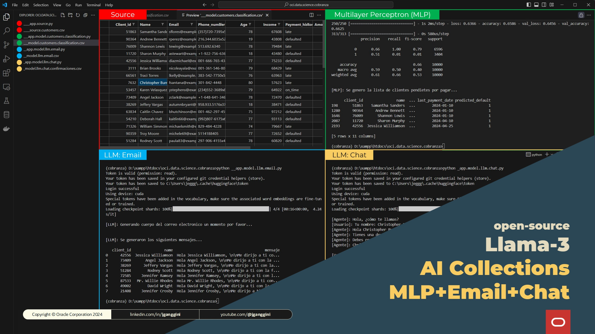

[![Issues][issues-shield]][issues-url]
[![LinkedIn][linkedin-shield]][linkedin-url]


<!-- PROJECT LOGO -->
<br />
<p align="center">

  <h2 align="center">OCI Data Science</h3>

  <p align="center">
    Proyecto CodeLlama PLSQL Chat
    <br />
    <a href="./src"><strong>Explore the code »</strong></a>
    <br />
    <br />
    <a href="https://youtube.com/@jganggini">🎬 View Demo</a>
    ·
    <a href="https://github.com/jganggini/oracle-ai/issues">Report Bug</a>
    ·
    <a href="https://github.com/jganggini/oracle-ai/pulls">Request Feature</a>
  </p>
</p>

## Introducción

Este proyecto implica el ajuste fino e interacción con CodeLlama, un modelo de lenguaje, específicamente para tareas en PLSQL. A continuación se detallan los archivos y carpetas del proyecto:



## Requisitos Previos

1. Una cuenta en OCI (Oracle Cloud Infrastructure) con acceso a OCI Data Science.
2. Un entorno de desarrollo configurado con Jupyter Notebook.
3. Conocimientos básicos de Python, aprendizaje automático y técnicas de IA generativa.

## Contenido del Directorio

- **CodeLlama-2-7b-chat-plsql/**: Carpeta que contiene el modelo CodeLlama afinado para PLSQL.
- **results/**: Carpeta para almacenar los resultados de las interacciones con el modelo CodeLlama.
- **__dataset_plsql.csv**: Archivo CSV que contiene el conjunto de datos utilizado para afinar el modelo CodeLlama en tareas PLSQL.
- **__dataset-plsql-no-sys-message.jsonl**: Archivo JSON Lines con el conjunto de datos para afinar el modelo, excluyendo mensajes del sistema.
- **__fine-tuning-codellama.py**: Script en Python para afinar el modelo CodeLlama con el conjunto de datos proporcionado.
- **_chat-with-codellama.py**: Script en Python para interactuar con el modelo CodeLlama afinado.

## Descripción de Archivos

### CodeLlama-2-7b-chat-plsql/
Esta carpeta contiene el modelo CodeLlama afinado y optimizado para tareas PLSQL.

### results/
Esta carpeta se utiliza para almacenar los resultados de la ejecución de varios scripts con el modelo CodeLlama.

### __dataset_plsql.csv
Este archivo CSV contiene el conjunto de datos utilizado para afinar el modelo CodeLlama en tareas PLSQL. Incluye varios fragmentos de código PLSQL y comentarios correspondientes.

### __dataset-plsql-no-sys-message.jsonl
Archivo JSON Lines que contiene el conjunto de datos utilizado para afinar el modelo, excluyendo mensajes del sistema.

### __fine-tuning-codellama.py
Script en Python utilizado para afinar el modelo CodeLlama con el conjunto de datos proporcionado. Este script carga los datos, configura el modelo y realiza el proceso de ajuste fino.

### __fine-tuning-codellama.py
Script en Python utilizado para afinar el modelo CodeLlama con el conjunto de datos proporcionado. Este script realiza las siguientes tareas:

1. Carga el conjunto de datos desde un archivo CSV o JSONL.
2. Configura el modelo CodeLlama para el ajuste fino.
3. Realiza el proceso de ajuste fino utilizando el conjunto de datos.
4. Guarda el modelo afinado en el directorio especificado.

#### Prerrequisitos

Para ejecutar este script, necesitas tener instaladas las siguientes librerías de Python:

- `transformers`
- `datasets`
- `torch`
- `sklearn`
- `pandas`

## Uso

### Afinación del Modelo
Para afinar el modelo, ejecuta el script `__fine-tuning-codellama.py`. Asegúrate de que el conjunto de datos (__dataset_plsql.csv o __dataset-plsql-no-sys-message.jsonl) esté correctamente ubicado en el directorio.

```sh
python __fine-tuning-codellama.py
```

### Interacción con el Modelo
Para interactuar con el modelo afinado, ejecuta el script `_chat-with-codellama.py`. Este script permite enviar consultas en PLSQL y recibir respuestas generadas por el modelo.

```sh
python _chat-with-codellama.py
```


<!-- Contacto -->
## Contacto
Project Link: [https://github.com/jganggini](https://github.com/jganggini)

<!-- MARKDOWN LINKS & IMAGES -->
<!-- https://www.markdownguide.org/basic-syntax/#reference-style-links -->
[issues-shield]: https://img.shields.io/github/issues/othneildrew/Best-README-Template.svg?style=for-the-badge
[issues-url]: https://github.com/jganggini/oci-functions/issues
[linkedin-shield]: https://img.shields.io/badge/-LinkedIn-black.svg?style=for-the-badge&logo=linkedin&colorB=555
[linkedin-url]: https://www.linkedin.com/in/jganggini/