[![Issues][issues-shield]][issues-url]
[![LinkedIn][linkedin-shield]][linkedin-url]

<!-- Intro -->
<br />
<p align="center">
  
  <h2 align="center">Generative AI  RAG <br/> Oracle Cloud</h2>
  <p align="center">
    
    <br/>
    <strong>Data Architecture for Artificial Intelligence</strong>
    <br/>
    <a href="src/c-data-science/rag-opensearch-generative-ai/__development.ipynb">Explore the code 禄</a>
    <br/>
    <br/>
    <a href="https://youtu.be/RERLuvWjiCc?si=M-RmqVumwImYv4Rm"> View Demo</a>
    路
    <a href="https://github.com/jganggini/oci-functions/issues">Report Bug</a>
    路
    <a href="https://github.com/jganggini/oci-functions/pulls">Request Feature</a>
  </p>
</p>

<!-- Content -->
<details>
  <summary>Content</summary>
  <ol>
    <li><a href="#use-case">Use Case</a></li>
    <li><a href="#description">Description</a></li>
    <li>
        <a href="#steps">Steps</a>
        <ul>
            <li><a href="#virtual-cloud-networks">Virtual Cloud Networks</a></li>
            <li><a href="#bucket">Bucket [Documents]</a></li>
            <li><a href="#document-understanding">Document Understanding</a></li>
            <li><a href="#logging">Logging [Log]</a></li>
            <li><a href="#opensearch-part-1">OpenSearch [Part-1]</a></li>
            <li><a href="#virtual-machine-part-1">Virtual Machine [Part-1]</a></li>
            <li><a href="#opensearch-part-2">OpenSearch [Part-2]</a></li>
            <li><a href="#functions">Functions [Event]</a></li>
            <li><a href="#events">Events</a></li>
            <li><a href="#generative-ai">Generative AI</a></li>
            <li><a href="#data-science">Data Science</a></li>
            <li><a href="#virtual-machine-part-2">Virtual Machine [Part-2]</a></li>
        </ul>
    </li>
    <li><a href="#references">References</a></li>
    <li><a href="#contact">Contact</a></li>
  </ol>
</details>

# Use Case

Se necesita analizar documentos en diversos formatos y atender consultas sobre los documentos que nos permita poder evaluar los documentos para facilitar la busqueda y obtener respuestas rapidas. Para ello se requiere un motor de b煤squedas optimo que permita buscar en las paginas de los documentos para encontrar un dato en especifico, facilitando el acceso a datos para optimizar la identificaci贸n de oportunidades y mejorar la toma de decisiones estrat茅gicas.

# Description

<p align="center">
  Data Architecture for Artificial Intelligence
  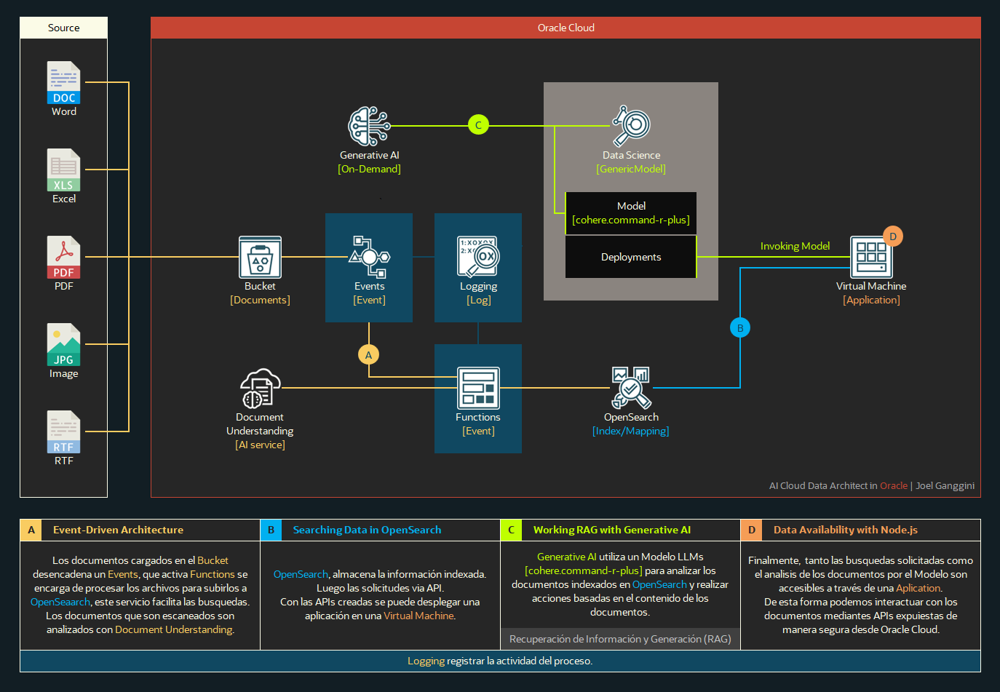
</p>

En esta arquitectura se integran componentes de Oracle Cloud con inteligencia artificial para procesar y analizar documentos en m煤ltiples formatos (DOC, XLS, PDF, JPG, RTF).
Los documentos cargados en un Bucket desencadenan eventos que activan funciones serverless para procesarlos y almacenarlos en <strong>OpenSearch</strong>, facilitando la b煤squeda eficiente.
Utilizando <strong>Document Understanding</strong> y <strong>Generative AI</strong> con el modelo <strong>cohere.command-r-plus</strong>, se analizan los documentos para extraer y actuar sobre la informaci贸n contenida.
Las solicitudes y el acceso a los datos se gestionan mediante un APIs, asegurando la disponibilidad y escalabilidad de las aplicaciones desplegadas en una <strong>Virtual Machine</strong>.
Este enfoque garantiza un procesamiento robusto y una recuperaci贸n avanzada de informaci贸n. 
<a href="https://youtube.com/playlist?list=PLMUWTQHw13gbk738EGtr0fWwi40B81qEw&si=aHJHPmp_Ppr99tCO">[View More (+)]</a>

**Components**

* **Bucket [Documents]**: Los documentos son cargados al Bucket.
* **Events [Event]**: La carga de documentos en el bucket desencadena eventos que inician el procesamiento de los datos.
* **Logging [Log]**: Este componente registra todas las actividades del proceso, proporcionando un seguimiento detallado de las operaciones.
* **Functions [Event]**: Procesa los archivos cargados y los prepara para ser subidos a OpenSearch.
* **Document Understanding**: Utiliza OCR para convertir documentos escaneados en texto procesable, permitiendo su indexaci贸n y an谩lisis en los flujos de trabajo automatizados.
* **OpenSearch [Index/Mapping]**: Almacena e indexa la informaci贸n de los documentos para facilitar las b煤squedas.
* **Generative AI**: Disponibiliza el modelos para integrarlo de forma vers谩til a otros servicios que permitan el procesamiento de inforamcion para cubrir una amplia gama de casos de uso, como asistencia de redacci贸n, resumen, an谩lisis y chat.
* **Data Science**: Utiliza el modelo [cohere.command-r-plus] en Generative AI para analizar y generar res煤menes o insights de los documentos indexados en OpenSearch.
* **Virtual Machine [Application]**: Las APIs creadas pueden ser usadas por diversas aplicaciones.

# Steps

## Virtual Cloud Networks

  Ingresar a `Networking` ★ `Virtual Cloud Networks` ★ `Start VCN Wizard`

  Crear una `VCN` con el `Wizard`, llamada `vcn-demo`.

  <p align="center">
    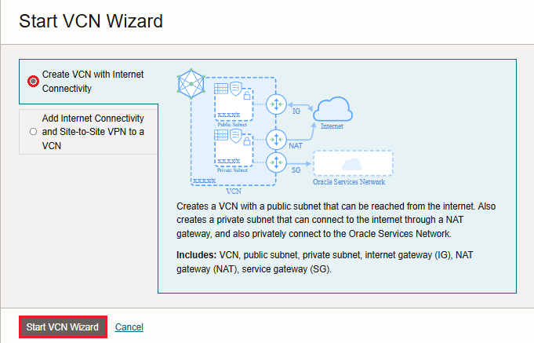
  </p>

  Ingresar a `Virtual Cloud Networks` ★ `vcn-demo` ★ `Security List Details` ★ `Default Security List for VCN`

  Agregar `Ingress Rules` los puertos `80`/`3389`/`9200`/`5601`

  <p align="center">
    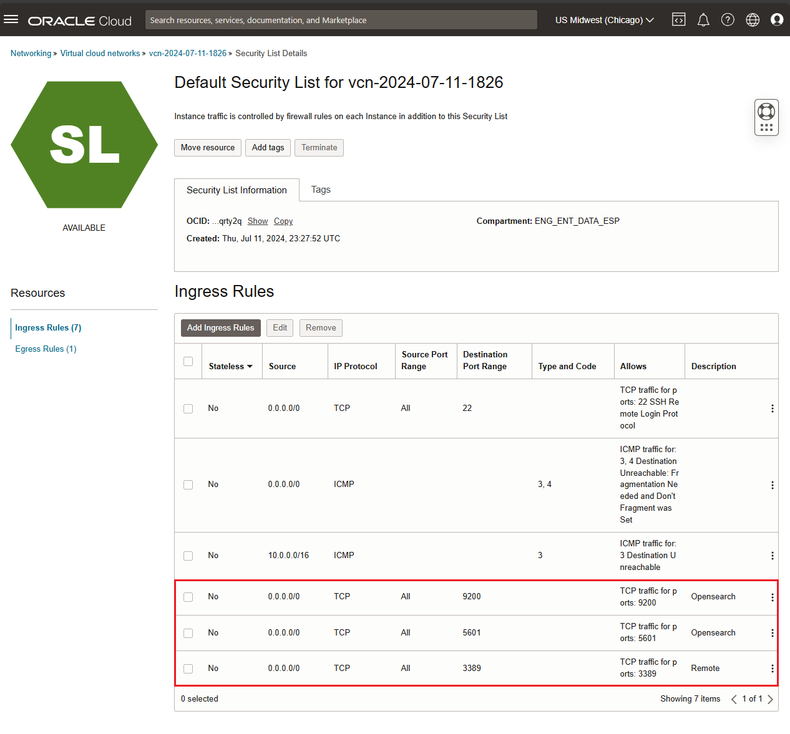
  </p>

## Bucket

  Ingresar a `Object Storage` ★ `Create Bucket`

  Crear un `bucket`, llamado `DLKLAGDEV` y seleccionar la opci贸n `Emit Object Events`.

  <p align="center">
    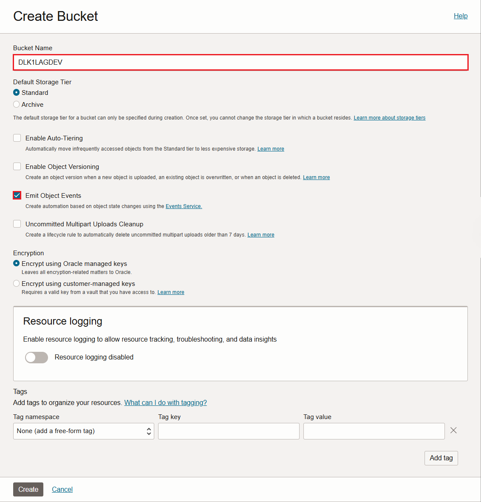
  </p>

## Document Understanding

  Ingresar a `Identity` ★ `Policies` ★ `Create Policy`

  Crear `Policies` para `DocumentUnderstanding`

  ```sql
  Allow any-user to manage ai-service-document-family in compartment <Compartment-Name>
  Allow any-user to read buckets in compartment <Compartment-Name>
  Allow any-user to manage objects in compartment <Compartment-Name>
  ```

## Logging

  Ingresar a `Identity` ★ `Policies` ★ `Create Policy`

  Crear `Policies` para `Loggings`

  ```sql
  Allow any-user to manage logging-family in compartment <Compartment-Name>
  ```

## OpenSearch Part-1

  Ingresar a `Identity` ★ `Policies` ★ `Create Policy`

  Crear `Policies` para `OpenSearch`

  ```sql
  Allow any-user to manage vnics in compartment <Compartment-Name>
  Allow any-user to manage vcns in compartment <Compartment-Name>
  Allow any-user to manage subnets in compartment <Compartment-Name>
  Allow any-user to use network-security-groups in compartment <Compartment-Name>
  Allow any-user to manage opensearch-family in compartment <Compartment-Name>
  ```

  Ingresar a `OpenSearch` ★ `Clusters` ★ `Create cluster`

  Crear un `Cluster` de OpenSearch

  1锔 Configure cluster
  - Name: `cluster-demo`
  - Software Version: `2.11.0`

  2锔 Configure Security
  - Username: `opensearch`
  - Passowrd: `0racL@3#d3m0`

  3锔 Configure nodes
  - Node Opetimization optins: Development

  4锔 Configure networking
  - Virtual Cloud Network: `vcn-demo`
  - Subnet: `Public Subnet`

  5锔 Summary

  <p align="center">
      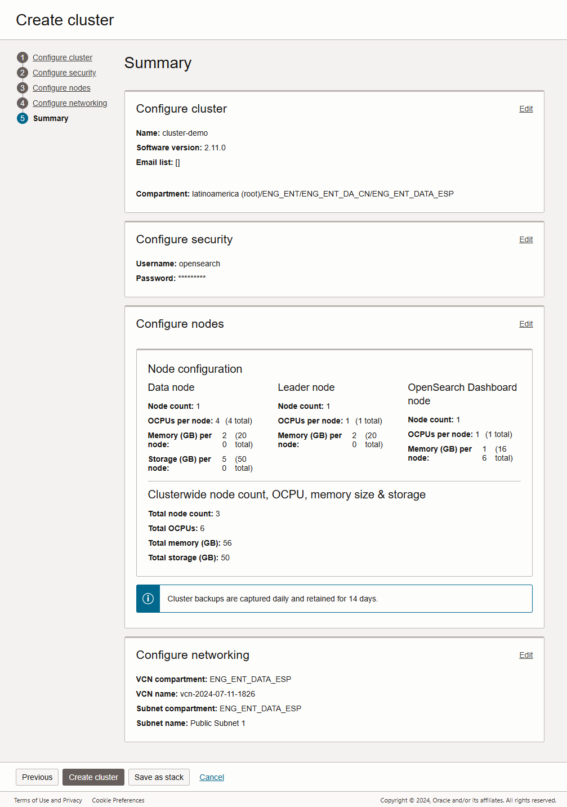
  </p>

  Copiar las URLs de `OpenSearch`:
  - API endpoint: `https://***.opensearch.us-chicago-1.oci.oraclecloud.com:9200`
  - OpenSearch Dashboard API endpoint: `https://***.opendashboard.us-chicago-1.oci.oraclecloud.com:5601`
  
  <p align="center">
    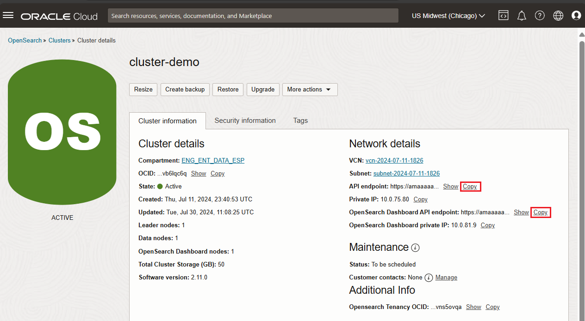
  </p>

## Virtual Machine Part-1

  Ingresar a `Compute` ★ `Instances` ★ `Create Instance`

  Crear la `Virtual Machines` para acceder a `OpenSource`.

  - Name: `instance-demo`
  - Image: `Windows Server 2022 Standard`
  - Shape: `VM.Standard.E4.Flex`
  - Primary network: `vcn-demo`
  - Subnet: `Public Subnet`

  Copiar la direcci贸n IP de la `Virtual Machines` para acceder.

  Descargar [Nginx](https://nginx.org/en/download.html) e Instalar.

  Editar el archivo [nginx.conf](/src/d-virtual-machine/nginx-1.27.0/conf/nginx.conf) y agregar las URLs de `OpenSource`.

  ```config
  server {
      listen       9200;
      server_name  localhost;

      location / {
          proxy_pass https://***.opensearch.us-chicago-1.oci.oraclecloud.com:9200/;
          proxy_set_header Host $host;
          proxy_set_header X-Real-IP $remote_addr;
          proxy_set_header X-Forwarded-For $proxy_add_x_forwarded_for;
          proxy_set_header X-Forwarded-Proto $scheme;
      }

      error_page   500 502 503 504  /50x.html;
      location = /50x.html {
          root   html;
      }
  }

  server {
      listen       5601;
      server_name  localhost;

      location / {
          proxy_pass https://***.opendashboard.us-chicago-1.oci.oraclecloud.com:5601/;
          proxy_set_header Host $host;
          proxy_set_header X-Real-IP $remote_addr;
          proxy_set_header X-Forwarded-For $proxy_add_x_forwarded_for;
          proxy_set_header X-Forwarded-Proto $scheme;
      }

      error_page   500 502 503 504  /50x.html;
      location = /50x.html {
          root   html;
      }
  }
  ```

  Ingresar a `CMD` en modo administrador y reiniciar `Nginx`.

  ```cmd
  Microsoft Windows [Version 10.0.20348.2527]
  (c) Microsoft Corporation. All rights reserved.

  C:\Windows\system32>cd..
  C:\Windows>cd..
  C:\>cd nginx-1.27.0
  C:\nginx-1.27.0>nginx.exe
  ```

  Ahora podremos ingresar a `OpenSearch` de forma publica con la IP de la `Virtual Machine`.

## OpenSearch Part-2

  Ingresar a OpenSearch con la IP de la `Virtual Machine`.
  
  Por ejemplo: `http://xxx.xxx.xxx.xxx:5601/`.
  
  Crear el indice `oci_documents` Ingresando a `Dev Tools` en `OpenSearch` y ejecutar el [Script](src/b-opensearch/_____oci_documents_create_index.json).

  <p align="center">
    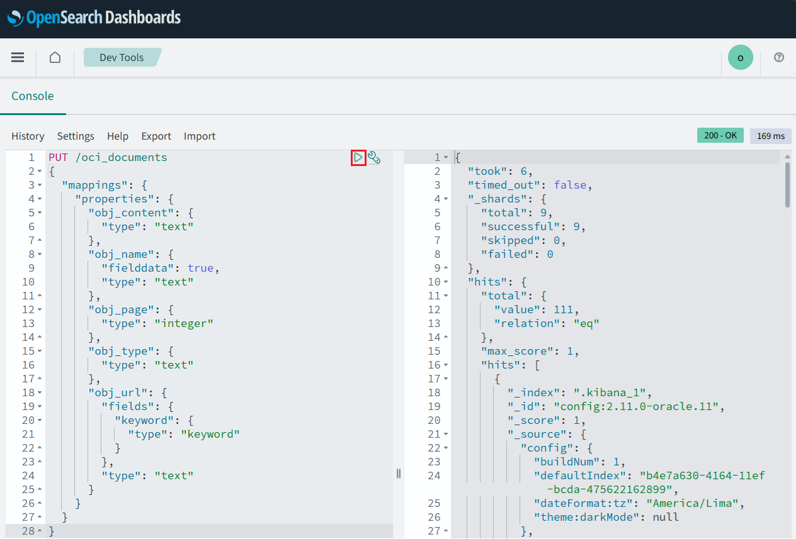
  </p>

## Functions

  Ingresar a `Functions` ★ `Policy Details` ★ `Create Policy`

  Crear `Policies` para `Functions` y `Cloud-Shell`.

  ```sql
  Allow any-user to manage buckets in compartment <Compartment-Name>
  Allow any-user to manage objects in compartment <Compartment-Name>
  Allow any-user to inspect instances in compartment <Compartment-Name>
  Allow any-user to manage functions-family in compartment <Compartment-Name>
  Allow service FaaS to manage repos in compartment <Compartment-Name>
  Allow service FaaS to use virtual-network-family in compartment <Compartment-Name>
  Allow any-user to manage cloud-shell in compartment <Compartment-Name>
  ```

  Ingresar a `Functions` ★ `Applications` ★ `Create Application`

  Crear una `Application`, llamada `app-demo`.
  seleccionar la `VCN` y la `Subnet`.

  <p align="center">
      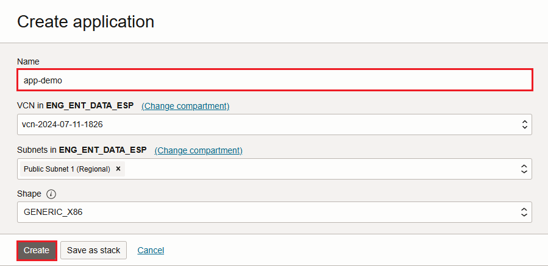
  </p>

  Ejecutamos los pasos del `1` al `7`. [Functions QuickStart on Cloud Shell](https://docs.public.oneportal.content.oci.oraclecloud.com/en-us/iaas/Content/Functions/Tasks/functionsquickstartcloudshell.htm#functionsquickstart_cloudshell).
  
  Ingresar a `Code Editor`

  <p align="center">
      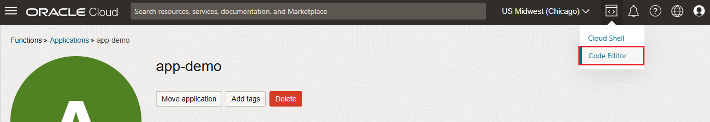
  </p>

  Abrir `Code Editor` ingresar a `Explorer`. [Creaci贸n de funciones en Code Editor](https://docs.oracle.com/es-ww/iaas/Content/Functions/Tasks/functionscreatingfunctions-usingcodeeditor.htm).

  Seleccionar `File` y luego en `New Folder`, ingresar el nombre de la Function `fn-opensearch`.
  
  Copiar el contenido de [fn-opensearch](/src/a-functions/fn-opensearch/) al `Folder` nuevo.
  
  <p align="center">
      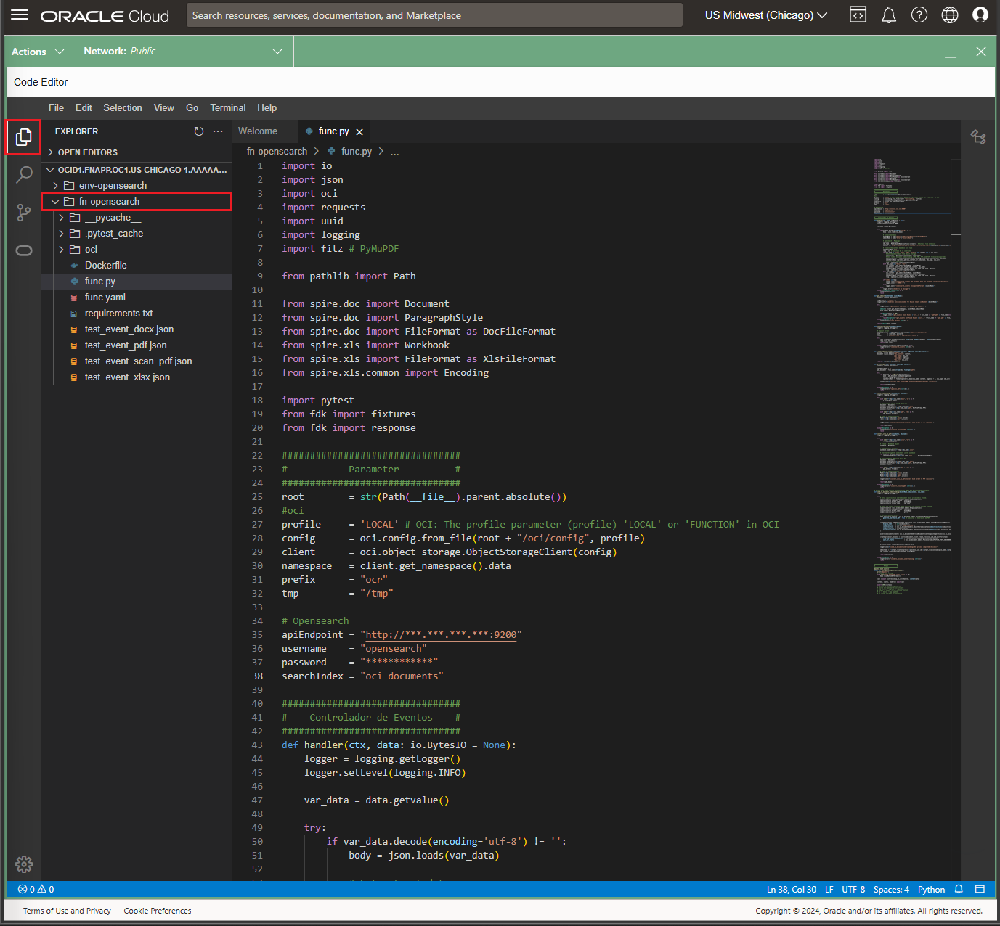
  </p>

  Abrir un `Terminal` y crear un `Environment` para la instalacion de las librerias.

  ```sh
  $ python3 -m venv env-opensearch
  $ source env-opensearch/bin/activate
  $ cd fn-opensearch
  $ pip install --upgrade -r requirements.txt
  ```

  Ingresar a `Identity` ★ `My profile` ★ `API keys` ★ `Add API key`

  Agregar un `API Key`, descargar y copiar los archivos (config/*.pen) en la carpeta `oci`.
  
  <p align="center">
    
  </p>
                  
  Modificar los `Parameter` del archivo [func.py](/src/a-functions/fn-opensearch/func.py).
  
  ```python
  ################################
  #           Parameter          #
  ################################
  root        = str(Path(__file__).parent.absolute())
  #oci
  profile     = 'LOCAL' # OCI: The profile parameter (profile) 'LOCAL' or 'FUNCTION' in OCI
  config      = oci.config.from_file(root + "/oci/config", profile)
  client      = oci.object_storage.ObjectStorageClient(config)
  namespace   = client.get_namespace().data
  prefix      = "ocr"
  tmp         = "/tmp"

  # Opensearch
  apiEndpoint = "http://***.***.***.***:9200"
  username    = "opensearch"
  password    = "************"
  searchIndex = "oci_documents"
  ```

  Para realizar ejecuciones locales desde `Code Editor` y simular las ejecuciones como si `Events` enviara los objectos por el `Event Type`: `Object - Create`, se debe ajustar el perfile a `LOCAL` y descomentar el codigo final del `pytest`.
  
  Los archivos [test_event_***.json](/src/a-functions/fn-opensearch/test_event_pdf.json) contaran con el formato enviado desde `Events` y seran usados por `PyTest` para las ejecuciones locales.

  ```python
  profile     = 'LOCAL'
  .
  .
  .
  ################################
  #            PyTest            #
  ################################
  @pytest.mark.asyncio
  async def test_parse_request_with_data():
  print("@pytest")
  # Produce Test Message
  with open("test_event_pdf.json", "rb") as fh:
      data = io.BytesIO(fh.read())
  
  call = await fixtures.setup_fn_call(handler, content=data)

  content, status, headers = await call

  assert 200 == status
  ```

  Para realizar estas ejecuciones locales es necesario subir al `Bucket` los archivos de prueba [archivos de Prueba](src/a-bucket).

  <p align="center">
    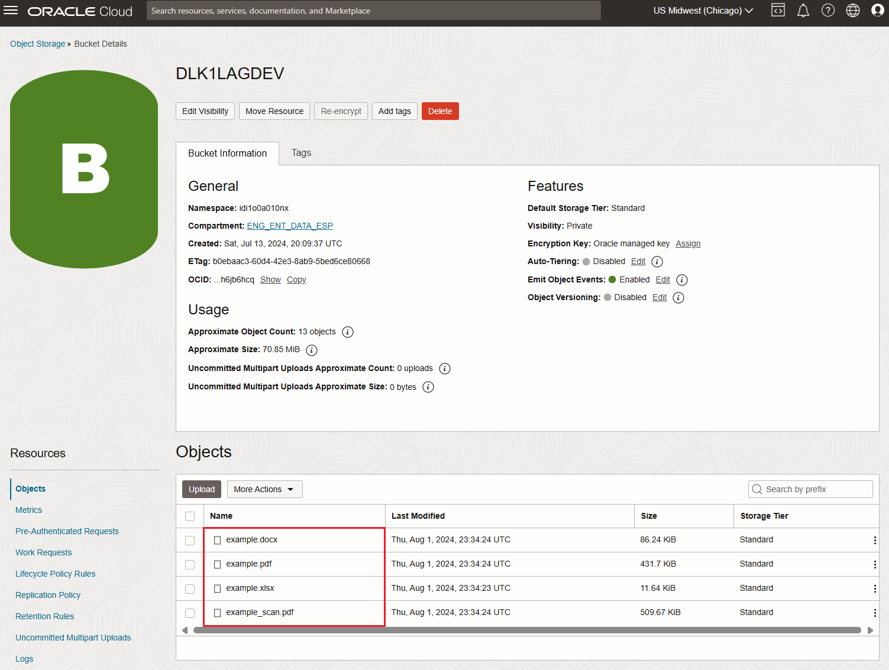
  </p>

  Abrir el `Terminal` e ingresar al `Folder` fn-opensearch para ejecutar `PyTest`.

  ```sh
  $ cd fn-opensearch
  $ python -m pytest -v -s --tb=long func.py
  ```

  Ejemplo de una ejecicion `LOCAL`.

  <p align="center">
    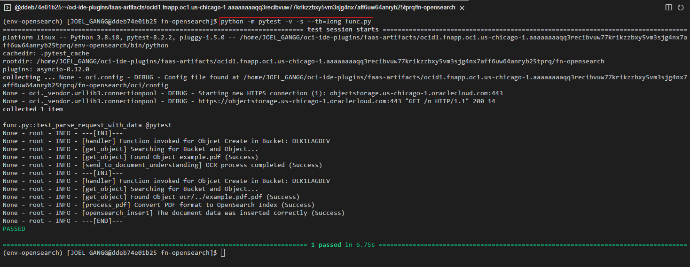
  </p>

  Para desplegar la `Function` se debe ajustar el perfile a `FUNCTION` y comentar el codigo final del `pytest`.

  ```python
  profile     = 'FUNCTION'
  .
  .
  .
  '''
  ################################
  #            PyTest            #
  ################################
  @pytest.mark.asyncio
  async def test_parse_request_with_data():
  print("@pytest")
  # Produce Test Message
  with open("test_event_pdf.json", "rb") as fh:
      data = io.BytesIO(fh.read())
  
  call = await fixtures.setup_fn_call(handler, content=data)

  content, status, headers = await call

  assert 200 == status
  '''
  ```

  Abrir el `Terminal` e ingresamos al `Folder` fn-opensearch para ejecutar el comando de despliegue.

  ```sh
  $ cd fn-opensearch
  $ fn -v deploy --app app-demo
  ```

  Ingresar a la `Aplication` y editar la `Function` desplegada `fn-opensearch`. Se amplia el Timeout a `300` segundos y Se habilita `Concurrency`.

  <p align="center">
    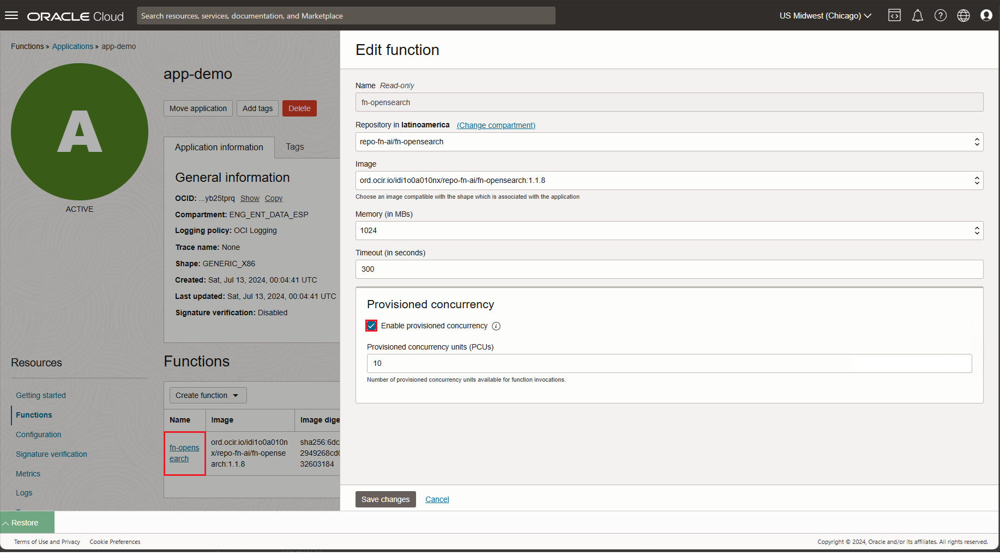
  </p>
    
## Events

  Ingresar a `Identity` ★ `Policies` ★ `Create Policy`

  Crear `Policies` para `Events`

  ```sql
  Allow any-user to inspect streams in compartment <Compartment-Name>
  Allow any-user to manage cloudevents-rules in compartment <Compartment-Name>
  Allow any-user to use stream-push in compartment <Compartment-Name>
  Allow any-user to use stream-pull in compartment <Compartment-Name>
  ```

  Ingresar a `Events` ★ `Create Rule`

  Crear `Ruler` en `Events`
  
  - Condition: `Event Type`
  - Service Name: `Object Storage`
  - Event Type: `Object - Create`
  - ACtion Type: `Functions`
  - Function Compartment: <Compartment-Name>
  - Function Application: `app-demo`
  - Function `fn-opensearch`

  <p align="center">
    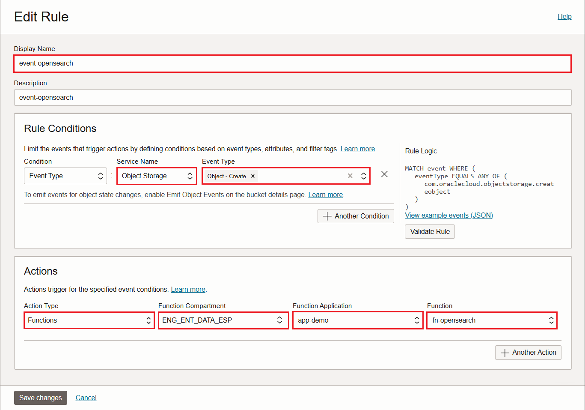
  </p>

## Generative AI
    
  Ingresar a `Identity` ★ `Policies` ★ `Create Policy`

  Crear `Policies` para `GenerativeAI`

  ```sql
  Allow any-user to use generative-ai-family in compartment <Compartment-Name>
  ```
  
  Ingresar a `Generative AI` ★ `Chat`

  Copiar el `OCID` del Chat para usarlo en el parametro `[genai_inference]` en el modelo de [Data Science](src/c-data-science/data-science-rag-generative-ai-deploy.ipynb).

  <p align="center">
    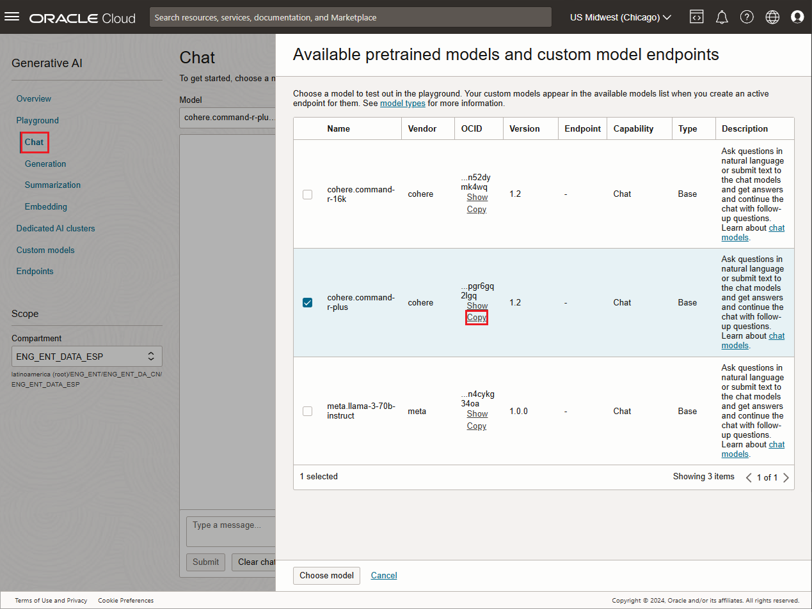
  </p>

  Los parametros de los modelos de `Generatie AI` seran usados para desplegar un modelo personalizado en [Data Science](src/c-data-science/data-science-rag-generative-ai-deploy.ipynb).
  
  ```python
  # oci: Generative AI
  compartment_id   = os.environ['NB_SESSION_COMPARTMENT_OCID']
  service_endpoint = "https://inference.generativeai.us-chicago-1.oci.oraclecloud.com"
  genai_embeddings = "cohere.embed-multilingual-v3.0"
  genai_inference  = "ocid1.generativeaimodel.oc1.us-chicago-1.**********************"
  auth_type        = "RESOURCE_PRINCIPAL"
  ```

## Data Science

  Ingresar a `Data Science` ★ `Projects` ★ `Create Project`

  Crear `Project`, llamado `ds-demo`

  Ingresar a `Projects` ★ `Project Details` ★ `Create Notebook Session`

  - Name: `ds-demo`
  - Compute Shape: `VM.Standard.E4.Flex`
  - Custom networking
  - Public endpoint
  - VCN: `vcn-demo`
  - Subnet: `Private Subnet`

  Crear Folder `rag-opensearch-generative-ai`.
  
  Copiar el contenido de [rag-opensearch-generative-ai](src/c-data-science/rag-opensearch-generative-ai/) al `Folder` nuevo.

  Ingresar al `Terminal` y ejecutar el siguiente comando para crear un `Environment` que usara el archivo [environment.yaml](src/c-data-science/rag-opensearch-generative-ai/environment.yaml).

  ```sh
  (base) bash-4.2$ odsc conda create -f environment.yaml -n langchain_env -v 1.5
  ```

  Selecionar el Environment `langchain_env_v1_5`

  <p align="center">
    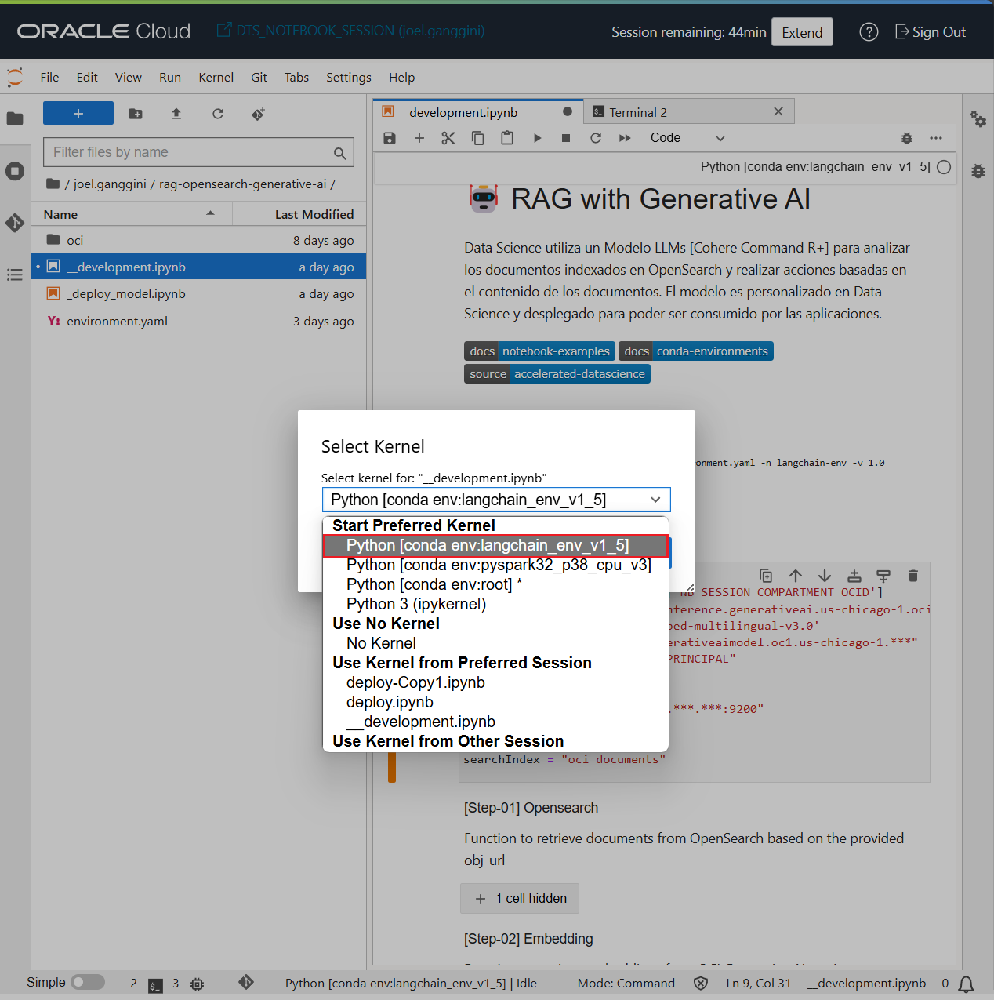
  </p>

  Reemplazar los parametros en el Notebook [development.ipynb](src/c-data-science/rag-opensearch-generative-ai/__development.ipynb).

  ```python
  # oci: Generative AI
  compartment_id   = os.environ['NB_SESSION_COMPARTMENT_OCID']
  service_endpoint = "https://inference.generativeai.us-chicago-1.oci.oraclecloud.com"
  genai_embeddings = 'cohere.embed-multilingual-v3.0'
  genai_inference  = "ocid1.generativeaimodel.oc1.us-chicago-1.***"
  auth_type        = "RESOURCE_PRINCIPAL"

  # oci: OpenSearch
  apiEndpoint = "http://***.***.***.***:9200"
  username    = "opensearch"
  password    = "**********"
  searchIndex = "oci_documents"
  ```

  Al ejecutar el `Notebook` veremos los resultados de nuestra consulta.

  <p align="center">
    
  </p>

  Para desplegar el Modelo ingresaremos al Notebook [deploy_model.ipynb](src/c-data-science/rag-opensearch-generative-ai/_deploy_model.ipynb).

  Seguir los pasos de `[Step-02] Prepare Model`, `[Step-03] Prepare Model` y `[Step-04] Save Model`

  <details open="open">
  <summary><font size="2">Pre-Requirements</font></summary>
  <font size="1">

  ```sh
  !(base) bash-4.2$ odsc conda init -b <bucket-name> -n <namespace> -a <api_key or resource_principal>
  !(base) bash-4.2$ odsc conda init -b <bucket-name> -n <namespace> -a resource_principal
  !(base) bash-4.2$ odsc conda publish -s <slug>
  !(base) bash-4.2$ odsc conda publish -s langchain_env_v1_5
  <pack> ="oci://<bucket-name>@<namespace>/conda_environments/cpu/langchain_env/1.5/langchain_env_v1_5"
  ```  

  </font>
  </details>

  <details open="open">
  <summary><font size="2">Delete (Optional)</font></summary>
  <font size="1">

  ```sh
  !(base) bash-4.2$ odsc conda delete -s <slug>
  !(base) bash-4.2$ odsc conda delete -s langchain_env_v1_5
  ```

  </font>
  </details>

  <details open="open">
  <summary><font size="2">generic_model.prepare</font></summary>
  <font size="1">

  ```sh
  generic_model.prepare(
      inference_conda_env      = <pack>,
      inference_python_version = "3.8",
      model_file_name          = "langchain.pkl",
      force_overwrite          = True
  )
  ```

  </font>
  </details>

  Despues de guardar el modelo seguir los pasos de `[Step-05] Deployment`.

  Ingresar a `Data Science` ★ `Projects` ★ `Model Deployments` ★ `Create Model Deployment`

  - Name: `Deploy RAG Generative AI v1.8.1`
  - Models: `RAG Generative AI v1.8.1`
  - Shape: `VM.Standard.E4.Flex`
  - Networking resources: `Custom networking` (`vcn-demo`/`Public Subnet`)

  <p align="center">
    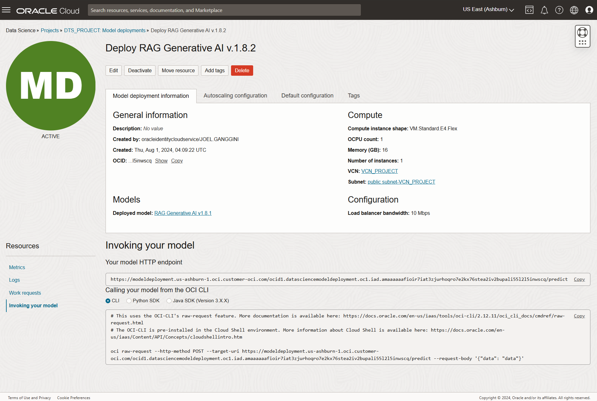
  </p>

  Copiar la URL `HTTP Endpoint` para usarla en nuestra aplicaci贸n.

## Virtual Machine Part-2

  Descargar [Node.js](https://nodejs.org/en/download/prebuilt-installer) e Instalar.

  Crear el directorio `C:\www\rag.opensearch.generative.ai` y copiar [rag.opensearch.generative.ai](src/d-virtual-machine/www/rag.opensearch.generative.ai/).

  Descargar [Visual Studio Code](https://code.visualstudio.com/download) e Instalar.

  Ingresar a `Visual Studio Code`, abrir un terminal y ejecutar el comando `npm install` para instalar las dependencias.

  ```cmd
  PS C:\www\rag.opensearch.generative.ai> npm install

  up to date, audited 323 packages in 2s

  28 packages are looking for funding
  run `npm fund` for details
  ```

  Configurar los parametros del archivo [.env](src/d-virtual-machine/www/rag.opensearch.generative.ai/.env)


  En el mismo terminal ejecutar el comando `node app.js`.

  ```cmd
  PS C:\www\rag.opensearch.generative.ai> node app.js
  server started on port 3000
  ```

  <p align="center">
    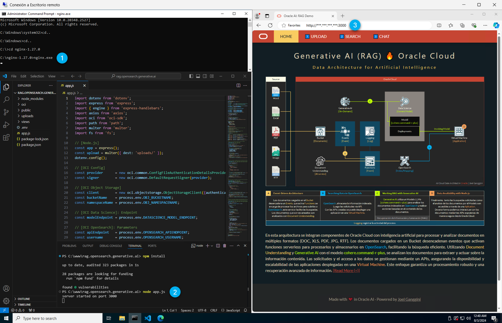
  </p>

<h5> Las pol铆ticas se aplicar贸n a todos los usuarios del tenant (any-usear) por ser una demo.</h5>

# References

- [Oracle: Other Frameworks](https://accelerated-data-science.readthedocs.io/en/latest/user_guide/model_registration/frameworks/genericmodel.html)
- [Oracle: Publishing a Conda Environment to an Object Storage Bucket in a Tenancy](https://docs.oracle.com/en-us/iaas/data-science/using/conda_publishs_object.htm)
- [Oracle: SDK for TypeScript and JavaScript](https://github.com/oracle/oci-typescript-sdk)
- [LangChain: langchain_community.embeddings.oci_generative_ai](https://api.python.langchain.com/en/latest/_modules/langchain_community/embeddings/oci_generative_ai.html)
- [LangChain: ChatOCIGenAI](https://python.langchain.com/v0.2/docs/integrations/chat/oci_generative_ai/)

# Contact
Project Link: [https://github.com/jganggini](https://github.com/jganggini)

<!-- MARKDOWN LINKS & IMAGES -->
<!-- https://www.markdownguide.org/basic-syntax/#reference-style-links -->
[issues-shield]: https://img.shields.io/github/issues/othneildrew/Best-README-Template.svg?style=for-the-badge
[issues-url]: https://github.com/jganggini/oci-functions/issues
[linkedin-shield]: https://img.shields.io/badge/-LinkedIn-black.svg?style=for-the-badge&logo=linkedin&colorB=555
[linkedin-url]: https://www.linkedin.com/in/jganggini/