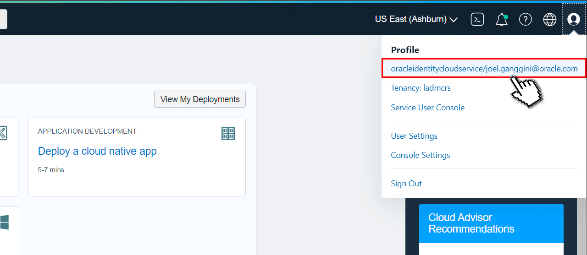

[![Issues][issues-shield]][issues-url]
[![LinkedIn][linkedin-shield]][linkedin-url]


<!-- Intro -->
<br />
<div align="center" style="text-align:center;">
  </img>
  <h1>Oracle AI 5 Demos en 1</h1>

  
  <table align="center">
    <tr style="font-size:medium;">
      <td colspan="4">Oracle Cloud</td>
      <td colspan="4">GPU & Frameworks</td>
    </tr>
    <tr align="center">
      <td></td>
      <td></td>
      <td></td>
      <td></td>
      <td></td>
      <td></td>
      <td></td>
      <td></td>
    </tr>
    <tr style="font-size:small;">
      <td>Generative AI</td>
      <td>Autonomous 23ai</td>
      <td>Document Undestanding</td>
      <td>Speech</td>
      <td>Meta</td>
      <td>LangChain</td>
      <td>Streamlit</td>
    </tr>
  </table>


  <br/>
  <h3>Building Data Architecture For AI/ML</h3>
  <br/>

  <table align="center">
    <tr style="font-size:medium;">
      <td colspan="1">Select AI</td>
      <td colspan="1">Select AI RAG</td>
    </tr>
    <tr align="center">
      <td></td>
      <td></td>
    </tr>
    <tr style="font-size:medium;">
      <td colspan="1">AI Speech to Text</td>
      <td colspan="1">AI Document Understanding</td>
    </tr>
    <tr align="center">
      <td></td>
      <td></td>
    </tr>
    <tr style="font-size:medium;">
      <td colspan="2">AI Document Multimodal</td>
    </tr>
    <tr align="center">
      <td colspan="2"></td>
    </tr>
  </table>

  <a style="font-size:large;" href="/src/">👨🏽‍💻 Explore the Code »</a>
  <br/>
  <a href="https://www.youtube.com/watch?v=6L1YmTRZNxM&list=PLMUWTQHw13gbk738EGtr0fWwi40B81qEw">🎬 View Demo</a>
  ·
  <a href="https://github.com/jganggini/oci-functions/issues">💣 Report Bug</a>
  ·
  <a href="https://github.com/jganggini/oci-functions/pulls">🚀 Request Feature</a>
</div>


Este documento describe los pasos necesarios para instalar y configurar el proyecto `Oracle AI 5 Demos en 1` disponible en [GitHub](https://github.com/jganggini/oracle-ai/tree/main/oracle-ai-5-demos-in-1).

## Requisitos Previos

### 1. Cuenta en Oracle Cloud Infrastructure (OCI)
Si no tiene una cuenta, regístrese en [Oracle Cloud](https://www.oracle.com/cloud/).

### 2. Servicios Necesarios
#### a) Autonomous Database
- Despliegue una instancia de Autonomous Database en OCI.

#### b) Object Storage Bucket
- Cree un bucket en OCI Object Storage.

#### c) Configurar Políticas de IAM
Se deben configurar las siguientes políticas para permitir el acceso adecuado:


###### OCI Document Understanding
```plaintext
Allow any-user to manage ai-service-document-family in tenancy
```
Read more: [About Document Understanding Policies](https://docs.oracle.com/en-us/iaas/Content/document-understanding/using/about_document-understanding_policies.htm).

###### OCI Speech
```plaintext
Allow any-user to manage ai-service-speech-family in tenancy
Allow any-user to read tag-namespaces in tenancy
Allow any-user to inspect tag-namespaces in tenancy
```
Read more: [About Speech Policies](https://docs.oracle.com/en-us/iaas/Content/speech/using/policies.htm).

###### OCI Generative AI
```plaintext
Allow any-user to manage ai-service-generative-family in tenancy
```
Read more: [Getting Access to Generative AI](https://docs.oracle.com/en-us/iaas/Content/generative-ai/iam-policies.htm).


##### Bucket
```plaintext
Allow any-user to read buckets in tenancy
Allow any-user to manage object-family in tenancy
Allow any-user to read objectstorage-namespaces in tenancy
```

### 3. Requisitos de la Máquina Local
- **Sistema Operativo:** Windows o macOS.
- **Anaconda (Conda):** Descargue e instale desde [Anaconda](https://www.anaconda.com/products/distribution).
- **Git:** Descargue e instale [Git](https://git-scm.com/).

## Instalación del Proyecto

### 1. Clonar el Repositorio
Ejecute en la terminal:
```bash
git clone https://github.com/jganggini/oracle-ai.git
```
O descargue el ZIP del repositorio y extraiga su contenido.

### 2. Crear Estructura de Carpetas
- **Windows:**
  ```bash
  mkdir C:\oracle-ai\oracle-ai-5-demos-in-1
  ```
- **macOS:**
  ```bash
  mkdir -p ~/oracle-ai/oracle-ai-5-demos-in-1
  ```
- Copie el contenido del repositorio clonado a esta carpeta.

### 3. Configurar el Wallet de Autonomous Database
- Descargue el Wallet desde la consola de OCI.

<p align="left">
  
</p>

- Coloque el archivo en:
  ```plaintext
  oracle-ai-5-demos-in-1/app/wallet
  ```

### 4. Generar API Key y Configurar la Carpeta .oci
#### a) Generar la API Key

- En OCI, agregue la clave `key.pem` en **User Settings -> API Keys**.

<p align="left">
  
</p>

#### b) Crear el Archivo de Configuración en `.oci`
- **Windows:**
  ```bash
  mkdir C:\Users\<su_usuario>\.oci
  ```
- **macOS:**
  ```bash
  mkdir ~/.oci
  ```
- Cree el archivo `config` en `.oci` con:
  ```plaintext
  [DEFAULT]
  user=<user_ocid>
  fingerprint=<fingerprint>
  key_file=~/.oci/key.pem
  tenancy=<tenancy_ocid>
  region=<region>
  ```

### 5. Configurar Variables de Entorno
Edite el archivo `.env` ubicado en `oracle-ai-5-demos-in-1/app/.env` y agregue los valores necesarios.

### 6. Instalar Dependencias y Ejecutar el Proyecto
Ejecute:
```bash
cd oracle-ai-5-demos-in-1
python setup.py
```

### 7. Ejecion Manual
#### **Windows:**
```bash
cd app
conda activate <env_name>
streamlit run app.py --server.port 8501
```

#### **macOS:**
```bash
cd app
source activate <env_name>
streamlit run app.py --server.port 8501
```

## Nota
Siguiendo estos pasos, el entorno estará listo para ejecutar las 5 demos de AI en Oracle Cloud.

## Video

<p align="left">
  <a href="https://youtu.be/ZDRz7aCPs2g?si=qgu2UOBrYb7ODhrG">
    
  </a>
</p>

<!-- MARKDOWN LINKS & IMAGES -->
<!-- https://www.markdownguide.org/basic-syntax/#reference-style-links -->
[issues-shield]: https://img.shields.io/github/issues/othneildrew/Best-README-Template.svg?style=for-the-badge
[issues-url]: https://github.com/jganggini/oci-functions/issues
[linkedin-shield]: https://img.shields.io/badge/-LinkedIn-black.svg?style=for-the-badge&logo=linkedin&colorB=555
[linkedin-url]: https://www.linkedin.com/in/jganggini/