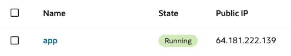

# Conexión a la instancia windows remota desde mac

El siguiente documento describe los pasos necesarios para conectarse a una instancia remota de Windows desde un sistema operativo macOS

Para conectarnos a la instancia remota podemos usar la app Windows App, disponible en la app store.

En la aplicación, podemos agregar un pc haciendo clic en la parte superior derecha.

Se abrirá una ventana en donde únicamente escribiremos la ip de la instancia, cuando abrimos la pantalla de instancias, podemos ver la lista de las instancias que están corriendo, cada instancia muestra su nombre, seguido de su ip pública.

Esta es la ip que escribiremos en el primer campo del panel

Si el puerto 3389 en la instancia ya está abierto, nos redirigiremos a la pantalla de login de windows, en donde es necesario ingresar con el usuario opc y la contraseña provista en la sección de Instance access, a la que tendremos acceso haciendo clic en nuestra instancia.

