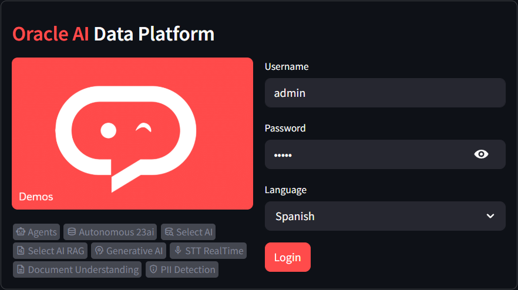
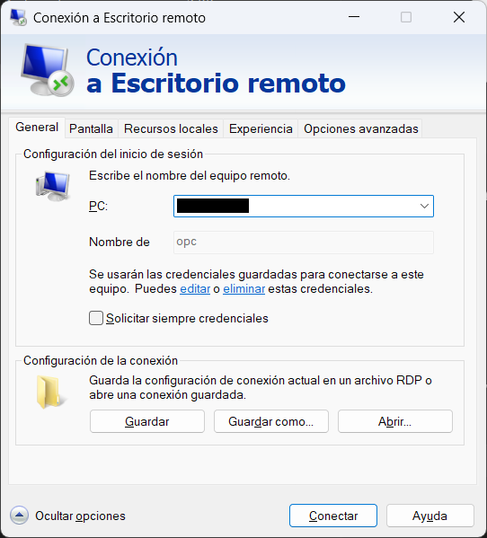
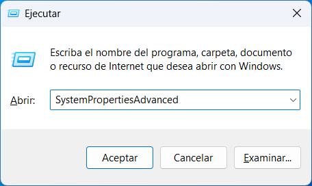
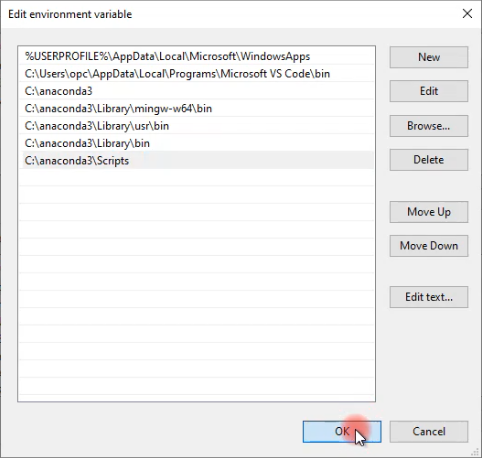
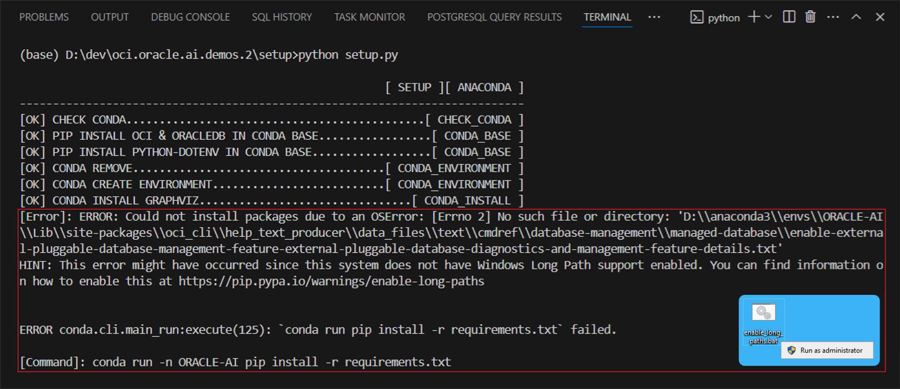
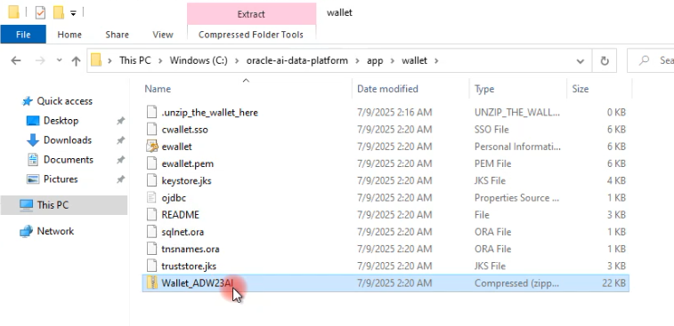
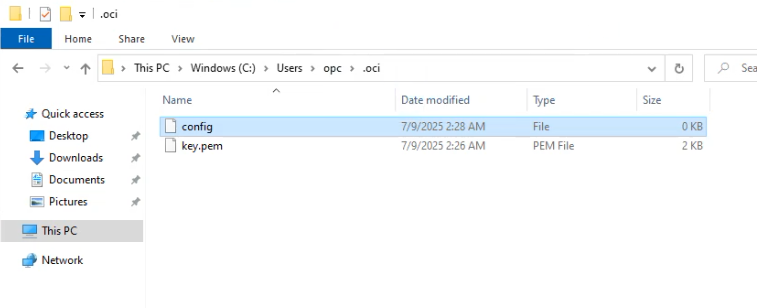

[![Issues][issues-shield]][issues-url]
[![LinkedIn][linkedin-shield]][linkedin-url]


<!-- Intro -->
<br />
<div align="center" style="text-align:center;">
  </img>
  <h1 style="font-size:40px; font-bload"><b style="color:#ec4b42">Oracle AI</b> Data Platform</h1>
  
  <a style="font-size:large;" href="/src/">👨🏽‍💻 Explore the Code »</a>
  <br/>
  <a href="https://www.youtube.com/watch?v=6L1YmTRZNxM&list=PLMUWTQHw13gbk738EGtr0fWwi40B81qEw">🎬 View Demo</a>
  ·
  <a href="https://github.com/jganggini/oci-functions/issues">💣 Report Bug</a>
  ·
  <a href="https://github.com/jganggini/oci-functions/pulls">🚀 Request Feature</a>

  
</div>

## 📄 Project Description

Oracle AI Data Platform es una solución integral que permite gestionar y analizar datos provenientes de múltiples fuentes como documentos, imágenes, archivos de audio y texto, mediante módulos de inteligencia artificial desplegados sobre Oracle Autonomous Database 23ai. Utiliza servicios avanzados de OCI como Generative AI, Document Understanding y Speech para aplicar procesamiento de lenguaje natural, extracción de texto, transcripción en tiempo real y análisis semántico. Toda la información es estructurada, almacenada y consultada desde una base vectorial en Oracle 23ai, lo que habilita búsquedas inteligentes, análisis de similitud y flujos de trabajo asistidos por agentes IA configurables, con control de acceso y compartición entre usuarios.

## 🎯 Use Cases
  * Análisis de documentos legales o médicos con detección automática de entidades sensibles.
  * Transcripción en tiempo real de entrevistas o llamadas de soporte.
  * Clasificación y comprensión automática de documentos escaneados.
  * Recuperación de información basada en embeddings semánticos para sistemas de búsqueda tipo RAG (Retrieval-Augmented Generation).

## 📋 Requirements

  ### 1. Create and Activate an Oracle Cloud Account
  Si no tiene una cuenta, regístrese en [Oracle Cloud](https://www.oracle.com/cloud/free/).

  💡 `Nota`: Para garantizar compatibilidad con todos los servicios requeridos, elige una región como `us-chicago-1`.

  ### 2. Creating and Preparing Services for the Project

  Oracle AI Data Platform, reúne los servicios esenciales para desplegar tu proyecto, incluyendo base de datos, almacenamiento, instancia de cómputo, políticas de acceso y capacidades de inteligencia artificial como Generative AI, análisis de documentos y transcripción en tiempo real y mucho más.

  <div align="center" style="text-align:center;">
    <table align="center">
      <tr style="font-size:medium;">
        <td colspan="8">Oracle AI Data Platform</td>
      </tr>
      <tr align="center">
        <td></td>
        <td></td>
        <td></td>
        <td></td>
        <td></td>
        <td></td>
        <td></td>
        <td></td>
      </tr>
      <tr style="font-size:small;">
        <td>Project <br/> Compartment</td>
        <td>Autonomous <br/> Database 23ai</td>
        <td>Object Storage <br/> Bucket</td>
        <td>Compute  <br/> Instance</td>
        <td>Policies <br/> for Services</td>
        <td>Generative AI <br/> for Agents</td>
        <td>Document <br/> Understanding</td>
        <td>Speech <br/> for Realtime</td>
      </tr>
    </table>
  </div>

  A continuación, se describen los pasos necesarios para crear y configurar los servicios esenciales que utilizará el proyecto dentro de Oracle Cloud. Cada uno de ellos puede activarse desde la consola web siguiendo las indicaciones detalladas en esta guía.

  #### a) Create Compartment
  
  - Ingrese a ➡️ `Compartments` ➡️ `Create Compartment`.
  - Cree un `compartment` para el proyecto.
    - Name: `oracle-ai-demo`
    - Description: `oracle-ai-demo`
    - Parent Compartment: `Root Compartment`
    - `[Create]`


  #### b) Create Autonomous Database 23ai
  
  - Ingrese a ➡️ `Autonomous Database` ➡️ `Create Autonomous Database`.
  - Cree un `Data Warehouse` o `Transaction Processing` para el proyecto.
    - Display name: `ADB23AI`
    - Database name: `ADB23AI`
    - Compartment: `oracle-ai-demo`
    - Workload type: `Data Warehouse` o `Transaction Processing`.
    - Database configuration:
      - Choose database version: `23ai`
      - ECPU count: `4`
    - Administrator credentials creation:
      - Password: `password`
      - Confirm password: `password`
    - Network access:
      - Access type: `Secure access from everywhere`
    - `[Create]`

  #### c) Create Object Storage Bucket
  
  - Ingrese a ➡️ `Buckets` ➡️ `Create Bucket`.
  - Cree un `Bucket` para el proyecto.
    - Bucket name: `ORACLE-AI-RAG`
    - Default Storage Tier: `Standard`
    - Encryption: `Encrypt using Oracle managed Keys`
    - `[Create]`

  - Selecionar `Edit Visibility` y editar la visibilidad del bucket para que sea accesible de forma publica 
    - Visibility: `Public`.
    - `[Save Changes]`

  #### d) Create Instance (Optional)
  
  Si deseas desplegar y probar el proyecto en la nube, puedes crear temporalmente una instancia de cómputo en Oracle Cloud, lo cual es útil para ejecutar la aplicación en un entorno alojado. Alternativamente, puedes optar por ejecutar el proyecto en tu propia máquina local.

  - Ingrese a ➡️ `Compute` ➡️ `Instances`
  - Cree una `Instance` para el proyecto.
    - Name: `app`
    - Placement:
      - Availability domain: `AD 1`
    - Image and shape:
      - `[Change Image]`
        - Select an image: `Windows`
        - Image name: `Windows Server 2022 Standar`
        - `[Select image]`
      - `[Change Shape]`
        - Instance type: `Virtual machine`
        - Shape series: `AMD`
        - Shape name: `VM.Standard.E4.Flex`
          - Number of OCPUs: `4`
          - Amount of memory (GB): `64`
        - `[Select Shape]`
    - Network:
      - Primary network: `Create new virtual cloud network`
        - New virtual cloud network name: `vcn-oracle-ai-demo`
        - Create in compartment: `oracle-ai-demo`
        - Subnet: `Create new subnet`
          - New subnet name: `subnet-YYYYMMDD-HHSS`
          - Create in compartment: `oracle-ai-demo`
          - CIDR block: `10.0.0.0/24`
    - `[Create]`

  #### e) Virtual Cloud Network (Optional)
  
  - Ingrese a ➡️ `Compute` ➡️ `Instances`
  - Seleccione la `Instance` que creaste en el paso anterior.
  - Ingrese a ➡️ `Instance details` ➡️ `Virtual cloud network` ➡️ `vcn-oracle-ai-demo`
  - Ingrese a ➡️ `Security` ➡️ `Security Lists` ➡️ `Default Security List for vcn-oracle-ai-demo` ➡️ `Security rules`
  - `[Add Ingress Rules]`
    - Source Type: `CIDR`
    - Source CIDR: `0.0.0.0/0`
    - IP Protocol: `TCP`
    - Destination Port Range: `3389`
    - Description: `RPD`
  - `[+ Another Ingress Rules]`
    - Source Type: `CIDR`
    - Source CIDR: `0.0.0.0/0`
    - IP Protocol: `TCP`
    - Destination Port Range: `8501`
    - Description: `App`
  - `[Add Ingress Rules]`  

  #### f) Configuring Policies in Identity
  
  - Ingrese a ➡️ `Identity` ➡️ `Policies`
  - Se deben configurar las siguientes políticas para permitir el acceso adecuado:

    #### f.1) OCI Document Understanding
    
    ```plaintext
    Allow any-user to manage ai-service-document-family in compartment oracle-ai-demo
    ```
    Read more: [About Document Understanding Policies](https://docs.oracle.com/en-us/iaas/Content/document-understanding/using/about_document-understanding_policies.htm).

    #### f.2) OCI Speech
    
    ```plaintext
    Allow any-user to manage ai-service-speech-family in compartment oracle-ai-demo
    Allow any-user to read tag-namespaces in compartment oracle-ai-demo
    Allow any-user to inspect tag-namespaces in compartment oracle-ai-demo
    ```
    Read more: [About Speech Policies](https://docs.oracle.com/en-us/iaas/Content/speech/using/policies.htm).

    #### f.3) OCI Generative AI
    
    ```plaintext
    Allow any-user to manage generative-ai-family in compartment oracle-ai-demo
    ```
    Read more: [Getting Access to Generative AI](https://docs.oracle.com/en-us/iaas/Content/generative-ai/iam-policies.htm).

    #### f.4) OCI Object Storage: Bucket
    
    ```plaintext
    Allow any-user to read buckets in compartment oracle-ai-demo
    Allow any-user to manage object-family in compartment oracle-ai-demo
    Allow any-user to read objectstorage-namespaces in compartment oracle-ai-demo
    ```

    #### f.5) All Resources (Optional)
    
    Si estás realizando pruebas o laboratorios en una cuenta trial de Oracle Cloud, puedes usar temporalmente la siguiente política para facilitar el acceso sin restricciones:

    ```plaintext
    Allow any-user to manage all-resources in compartment oracle-ai-demo
    ```

    💡 `Nota`: Esta política otorga permisos completos a todos los usuarios autenticados sobre todos los recursos en el tenancy, por lo que debe utilizarse únicamente en entornos controlados, personales y no compartidos. Se recomienda eliminarla una vez finalizadas las pruebas para evitar acciones accidentales o un consumo innecesario de recursos que puedan agotar tu crédito trial.

  ### 3. Instance or Local Machine Configuration

  En esta sección se configura el entorno necesario para ejecutar el proyecto, ya sea en una instancia en la nube o en una máquina local. A continuación, se presentan las principales tecnologías que conforman el stack de inteligencia artificial utilizado en la solución.

  <div align="center" style="text-align:center;">
    <table align="center">
      <tr style="font-size:medium;">
        <td colspan="5">AI Stack</td>
      </tr>
      <tr align="center">
        <td></td>
        <td></td>
        <td></td>
        <td></td>
        <td></td>
      </tr>
      <tr style="font-size:small;">
        <td>xAI Grok</td>
        <td>Meta</td>
        <td>Cohere</td>
        <td>LangChain</td>
        <td>Streamlit</td>
      </tr>
    </table>
  </div>

  💡 `Nota`: Los pasos de instalación pueden variar dependiendo del sistema operativo que estés utilizando. Esta guía está enfocada principalmente en sistemas Windows.

  - Remote Desktop `(Windows)`:
      - Presiona `[Win + R]`
      - Escribir: `mstsc` y `[Aceptar]`

        
        
      - Ingrese a `Remote Desktop` ➡️
        - PC: `<Public IP Adress>`
        - User: `OPC`
        - Passowrd: `<Initial password>`

  #### a) Anaconda (Conda)
  
  Se utiliza Anaconda porque facilita la gestión de entornos y dependencias en proyectos de ciencia de datos e inteligencia artificial, evitando conflictos entre librerías.
  
  - Descargue e instale desde [Anaconda](https://www.anaconda.com/products/distribution).
  - Instale:
    - Install for: ✅ `All Users`
    - Destination Folder: `C:\anaconda3`
    - Advanced Installation Options:
      - ✅ Create shortcuts.
      - ✅ Register Acanconda3 as the system Python 3.13
      - ✅ Clear the package cache upon completion.

    - Edit the system environment variables `(Windows)`:
      - Presiona `[Win + R]`
      - Escribir: `SystemPropertiesAdvanced` y `[Aceptar]`

        
      
      - Ingrese a `System Properties` ➡️ `Advanced` ➡️ `[Environment Variables]`
      - Ingrese a `Environment Variables` ➡️ `[Path]` ➡️ `[Edit...]`
      - Ingrese a `Edit enviroment variable` ➡️ `[New]`

        ```plaintext
        C:\anaconda3
        C:\anaconda3\Library\mingw-w64\bin
        C:\anaconda3\Library\usr\bin
        C:\anaconda3\Library\bin
        C:\anaconda3\Scripts
        ```

        

      - `[OK]`

  #### b) Visual Studio Code (VSCode)
  
  Visual Studio Code (VSCode) es un editor ligero y potente que ofrece soporte nativo para Python y herramientas como Jupyter, lo que lo hace ideal para desarrollar y probar proyectos de IA.
  
  - Descargue e instale [VSCode](https://code.visualstudio.com/download).
  - Instalación por defecto.

  #### c) Maximum Path Length Limitation (Windows)
  
  Windows tiene una limitación de 260 caracteres para rutas de archivos, lo que puede causar errores en proyectos con carpetas o dependencias extensas. Para evitarlo, se recomienda habilitar el soporte para rutas largas desde el registro del sistema.

  Read more: [Maximum Path Length Limitation](https://learn.microsoft.com/en-us/windows/win32/fileio/maximum-file-path-limitation?tabs=registry).

  - Cree el archivo `enable-long-paths.bat` en el escritorio con el siguiente contenido: 

    ```cmd
    @echo off
    :: This script enables support for long file paths in Windows

    echo [INFO] Enabling long path support in the system...
    reg add "HKLM\SYSTEM\CurrentControlSet\Control\FileSystem" /v LongPathsEnabled /t REG_DWORD /d 1 /f

    if %errorlevel% EQU 0 (
        echo [OK] Long paths enabled successfully.
        echo [!] Please restart your computer to apply the changes.
    ) else (
        echo [ERROR] Failed to modify the registry. Run this script as Administrator.
    )

    pause
    ```

    💡 `Nota`: Ejecuta el script como Administrador y reinicia el sistema para aplicar los cambios y evitar errores durante la instalación del entorno.

    

  #### d) Copy project to Virtual Machine (Github)
  
  Para copiar el proyecto a la máquina virtual, siga estos pasos:(Github)

  - Clonar el Repositorio:
    ```bash
    git clone https://github.com/jganggini/oracle-ai.git
    ```
    O descargue el ZIP del repositorio. [Download ZIP](https://github.com/jganggini/oracle-ai/archive/refs/heads/main.zip) 
  
  - Cree la siguiente estructura de carpetas:
    - Para Windows:
      ```bash
      mkdir C:\oracle-ai-data-platform
      ```
    - Para MacOS:
      ```bash
      mkdir -p ~/oracle-ai-data-platform
      ```
    - Copie el contenido de la carpeta `oracle-ai-data-platform`.

  #### e) Wallet on Autonomus Database 23ai (ADB23ai)
  
  - Ingrese a ➡️ `Autonomous Database`
  - Seleccione el `Autonomous Database` que creaste en el paso anterior.
  - Ingrese a ➡️ `[Database connection]` ➡️ `[Download wallet]`
    - Ingrese un `Password` para proteger el `wallet`.
    - `[Download]`

  - Copie el archivo `wallet.zip` en:
    ```plaintext
    C:\oracle-ai-data-platform/app/wallet
    ```   

    Debera de quedar de la siguiente manera:

    

  #### f) Generate API Key

  - Ingrese a ➡️ `Identity` ➡️ `profile`
  - Seleccione su usuario.
  - Ingrese a ➡️ `Tokens and keys` ➡️ `Add API Key` ➡️ `Generate API Key pair` ➡️ `[Download private key]`
    - Seleccione `[Add]`
    - Seleccione `[Copy]`
    
    - Cree el archivo `config` en:
    ```plaintext
    C:\Users\opc\.oci\config
    ```

    - Con el contenido copiado:
    ```plaintext
    [DEFAULT]
    user=ocid1.user.oc1..***********
    fingerprint=**:**:**:**:**:**:**:**:**:**:**:**:**:**:**:**
    tenancy=ocid1.tenancy.oc1..***********
    region=us-chicago-1
    key_file=C:\Users\opc\.oci\key.pem
    ```

  - Copie el archivo `key.pem` descargado en:
    ```plaintext
    C:\Users\opc\.oci\key.pem
    ```   

    Debera de quedar de la siguiente manera:

    
    
    💡 `Nota`: El parámetro region en el archivo de configuración de OCI define la región por defecto para tus operaciones. Asegúrate de que coincida con la región donde se encuentra tu bucket de Object Storage; de lo contrario, no podrás acceder a él correctamente.

  #### g) Configure Environment Variables (.env)

  - Edite el archivo `.env` ubicado en:
    ```plaintext
    C:\oracle-ai-data-platform/app/.env
    ```

  #### h) Run Environment Setup Script (setup.py)
  
  Este script configura automáticamente las variables de entorno necesarias y valida los componentes requeridos para el proyecto. 
  
  💡 `Nota`: Asegúrate de haber editado previamente el archivo `.env` con tus datos.

  ```cmd
  conda activate
  cd oracle-ai-data-platform
  cd setup
  python setup.py
  ```

  #### i) Manual Execution (app.py)

  Ejecuta manualmente la aplicación principal desde el entorno configurado. Este comando inicia la interfaz web usando `Streamlit` en el puerto `8501`.

  ```cmd
  cd oracle-ai-data-platform
  cd app
  conda activate oracle-ai
  streamlit run app.py --server.port 8501
  ```

### 4. Data Model Documentation

Este modelo de datos está diseñado para una plataforma de análisis documental asistida por inteligencia artificial. Su objetivo es permitir a usuarios gestionar archivos, módulos funcionales, agentes de IA y análisis vectorial sobre fragmentos de documentos. Ofrece mecanismos de control de acceso, soporte para múltiples módulos AI y registro de metadatos enriquecidos.

<p align="center">
  
</p>

<div align="center" style="text-align:center;">
  Modelo: <a href="https://raw.githubusercontent.com/jganggini/oracle-ai/187534d131828be7e586b4ee0dff4b816d218fde/oracle-ai-data-platform/img/data-model.svg">Mermaidchart</a>
</div> 

#### a) Table Description and Initial Content

  #### a.1) `USER_GROUP`

  Agrupa a los usuarios según su rol, organización o permisos. Cada grupo puede tener múltiples usuarios.

  | Campo                   | Tipo            | Descripción                                 |
  |-------------------------|-----------------|---------------------------------------------|
  | `user_group_id`         | NUMBER (PK)     | Identificador único del grupo               |
  | `user_group_name`       | VARCHAR2(250)   | Nombre del grupo                            |
  | `user_group_description`| VARCHAR2(500)   | Descripción textual                         |
  | `user_group_state`      | NUMBER          | Estado del grupo (1 = activo)               |
  | `user_group_date`       | TIMESTAMP       | Fecha de creación                           |

  #### a.2) `USERS`

  Usuarios registrados en la plataforma. Cada usuario está vinculado a un grupo.

  | Campo                  | Tipo             | Descripción                                 |
  |------------------------|------------------|---------------------------------------------|
  | `user_id`              | NUMBER (PK)      | Identificador único del usuario             |
  | `user_group_id`        | NUMBER (FK)      | Clave foránea a `user_group`                |
  | `user_username`        | VARCHAR2(250)    | Nombre de usuario único                     |
  | `user_password`        | VARCHAR2(500)    | Contraseña de ingreso                       |
  | `user_sel_ai_password` | VARCHAR2(500)    | Contraseña para servicios AI                |
  | `user_name`            | VARCHAR2(500)    | Nombre del usuario                          |
  | `user_last_name`       | VARCHAR2(500)    | Apellido del usuario                        |
  | `user_email`           | VARCHAR2(500)    | Correo electrónico                          |
  | `user_modules`         | CLOB (JSON)      | Lista de módulos asignados (formato JSON)   |
  | `user_state`           | NUMBER           | Estado del usuario (1 = activo)             |
  | `user_date`            | TIMESTAMP        | Fecha de registro

  **Contenido inicial:**

  ```sql
  INSERT INTO users (
      user_id, user_group_id, user_username, user_password, user_sel_ai_password,
      user_name, user_last_name, user_email, user_modules
  ) VALUES (
      0, 0, 'admin', 'admin', 'p_a_s_s_w_o_r_d',
      'Joel', 'Ganggini', 'joel.ganggini@correo.com', '[0, 1, 2, 3, 4, 5, 6]'
  );
  ```

  #### a.3) `MODULES`

  Define los módulos funcionales que ofrece el sistema para el procesamiento de datos (p. ej. extracción de texto, RAG, OCR, etc).

  | Campo                  | Tipo             | Descripción                                    |
  |------------------------|------------------|------------------------------------------------|
  | `module_id`            | NUMBER (PK)      | Identificador único del módulo                 |
  | `module_name`          | VARCHAR2(250)    | Nombre del módulo                              |
  | `module_folder`        | VARCHAR2(250)    | Carpeta asociada al módulo (backend/frontend)  |
  | `module_src_type`      | VARCHAR2(250)    | Tipos de archivo de entrada (CSV, PDF, etc.)   |
  | `module_trg_type`      | VARCHAR2(250)    | Tipos de archivo de salida (TXT, JSON, etc.)   |
  | `module_vector_store`  | NUMBER           | Soporte para embeddings (1 = sí)               |
  | `module_state`         | NUMBER           | Estado (1 = activo)                            |
  | `module_date`          | TIMESTAMP        | Fecha de registro                              |

  **Contenido inicial:**

  ```sql
  INSERT INTO modules (module_id, module_name) VALUES (0, 'Administrator');
  INSERT INTO modules (...) VALUES (1, 'Select AI', 'module-select-ai', 'CSV', 'Autonomous Database');
  INSERT INTO modules (...) VALUES (2, 'Select AI RAG', 'module-select-ai-rag', 'TXT, HTML, DOC, JSON, XML', 'Autonomous Database');
  INSERT INTO modules (...) VALUES (3, 'AI Document Understanding', 'module-ai-document-understanding', 'PDF, JPG, PNG, TIFF', 'PDF, JSON', 1);
  INSERT INTO modules (...) VALUES (4, 'AI Speech to Text', 'module-ai-speech-to-text', 'M4A, MKV, MP3, MP4, OGA, OGG, WAV', 'TXT, SRT', 1);
  INSERT INTO modules (...) VALUES (5, 'AI Document Multimodal', 'module-ai-document-multimodal', 'JPEG, PNG', 'MD', 1);
  INSERT INTO modules (...) VALUES (6, 'AI Speech to Text Real-Time', 'module-ai-speech-to-realtime', 'JSON', 'TXT', 1);
  ```

  #### a.4) `AGENT_MODELS`

  Modelos de IA configurables para los agentes (LLM, VLM, etc.).

  | Campo                         | Tipo             | Descripción                                   |
  |-------------------------------|------------------|-----------------------------------------------|
  | `agent_model_id`              | NUMBER (PK)      | Identificador único del modelo                |
  | `agent_model_name`            | VARCHAR2(250)    | Nombre del modelo (identificador externo)     |
  | `agent_model_type`            | VARCHAR2(100)    | Tipo (`llm`, `vlm`)                           |
  | `agent_model_provider`        | VARCHAR2(250)    | Proveedor del modelo (meta, cohere, etc.)     |
  | `agent_model_service_endpoint`| VARCHAR2(500)    | Endpoint (placeholder por defecto)            |
  | `agent_model_state`           | NUMBER           | Estado (1 = activo)                           |
  | `agent_model_date`            | TIMESTAMP        | Fecha de registro                             |

  **Contenido inicial:** 11 modelos entre `cohere`, `meta`, `xai`.

  #### a.5) `AGENTS`

  Agentes configurados que usan un modelo para ejecutar tareas de QA, OCR, PII, etc.

  | Campo                      | Tipo             | Descripción                                   |
  |----------------------------|------------------|-----------------------------------------------|
  | `agent_id`                 | NUMBER (PK)      | Identificador único del agente                |
  | `agent_model_id`           | NUMBER (FK)      | Referencia a modelo en `agent_models`         |
  | `agent_name`               | VARCHAR2(250)    | Nombre del agente                             |
  | `agent_description`        | VARCHAR2(4000)   | Descripción de la funcionalidad               |
  | `agent_type`               | VARCHAR2(250)    | Tipo (`Chat`, `Extraction`, etc.)             |
  | `agent_max_out_tokens`     | NUMBER           | Máx. de tokens generados                      |
  | `agent_temperature`        | NUMBER (1,1)     | Parámetro de diversidad                       |
  | `agent_top_p`              | NUMBER (3,2)     | Nucleus sampling                              |
  | `agent_top_k`              | NUMBER (3,0)     | Top-K sampling                                |
  | `agent_frequency_penalty`  | NUMBER (3,2)     | Penalización por frecuencia                   |
  | `agent_presence_penalty`   | NUMBER (3,2)     | Penalización por presencia                    |
  | `agent_prompt_system`      | VARCHAR2(4000)   | Prompt del sistema                            |
  | `agent_prompt_message`     | VARCHAR2(4000)   | Mensaje inicial opcional                      |
  | `agent_state`              | NUMBER           | Estado del agente                             |
  | `agent_date`               | TIMESTAMP        | Fecha de creación                             |

  **Contenido inicial:** 5 agentes:
  - Document Agent
  - SRT Audio Agent
  - PII Anonymizer Agent
  - Image Analysis Agent
  - Image OCR Analysis Agent

  #### a.6) `AGENT_USER`

  Relación entre usuarios y agentes, incluyendo propiedad.

  | Campo             | Tipo             | Descripción                             |
  |-------------------|------------------|-----------------------------------------|
  | `agent_user_id`   | NUMBER (PK)      | Identificador único de relación         |
  | `agent_id`        | NUMBER (FK)      | Agente compartido o propio              |
  | `user_id`         | NUMBER (FK)      | Usuario propietario o colaborador       |
  | `owner`           | NUMBER           | 1 = Propietario, 0 = Compartido         |
  | `agent_user_state`| NUMBER           | Estado de relación                      |
  | `agent_user_date` | TIMESTAMP        | Fecha de asignación                     |

  **Contenido inicial:** Admin (`user_id = 0`) posee los 5 agentes.

  #### a.7) `FILES`

  Archivos subidos para análisis en los módulos.

  | Campo                    | Tipo             | Descripción                              |
  |--------------------------|------------------|------------------------------------------|
  | `file_id`                | NUMBER (PK)      | Identificador único del archivo          |
  | `module_id`              | NUMBER (FK)      | Módulo donde se subió el archivo         |
  | `file_src_file_name`     | VARCHAR2(500)    | Nombre original del archivo              |
  | `file_src_size`          | NUMBER           | Tamaño en bytes                          |
  | `file_src_strategy`      | VARCHAR2(500)    | Estrategia de extracción aplicada        |
  | `file_trg_obj_name`      | VARCHAR2(4000)   | Nombre del objeto generado               |
  | `file_trg_extraction`    | CLOB             | Contenido extraído                       |
  | `file_trg_tot_pages`     | NUMBER           | Páginas totales (si aplica)              |
  | `file_trg_tot_characters`| NUMBER           | Total de caracteres extraídos            |
  | `file_trg_tot_time`      | VARCHAR2(8)      | Tiempo total de audio (hh:mm:ss)         |
  | `file_trg_language`      | VARCHAR2(3)      | Idioma (`esa`, `en`, etc.)               |
  | `file_trg_pii`           | NUMBER           | Indicador si contiene PII                |
  | `file_description`       | VARCHAR2(500)    | Descripción manual                       |
  | `file_version`           | NUMBER           | Versión del archivo                      |
  | `file_state`             | NUMBER           | Estado (1 = activo)                      |
  | `file_date`              | TIMESTAMP        | Fecha de carga                           |

  #### a.8) `FILE_USER`

  Relación entre usuarios y archivos, con control de propiedad y acceso.

  | Campo            | Tipo             | Descripción                             |
  |------------------|------------------|-----------------------------------------|
  | `file_user_id`   | NUMBER (PK)      | ID único de relación                    |
  | `file_id`        | NUMBER (FK)      | Archivo referenciado                    |
  | `user_id`        | NUMBER (FK)      | Usuario que accede o es dueño           |
  | `owner`          | NUMBER           | 1 = Propietario                         |
  | `file_user_state`| NUMBER           | Estado de acceso                        |
  | `file_user_date` | TIMESTAMP        | Fecha de asignación                     |

  #### a.9) `DOCS`

  Fragmentos extraídos de archivos que se transforman en vectores semánticos.

  | Campo      | Tipo         | Descripción                                 |
  |------------|--------------|---------------------------------------------|
  | `id`       | NUMBER (PK)  | ID único del fragmento                      |
  | `file_id`  | NUMBER (FK)  | Archivo al que pertenece                    |
  | `text`     | CLOB         | Texto del fragmento                        |
  | `metadata` | CLOB         | Información adicional                      |
  | `embedding`| VECTOR       | Embedding vectorial para búsqueda semántica |

  - Índice: `docs_hnsw_idx` (similaridad coseno con precisión 95%)
  - Trigger y secuencia de auto-incremento activados

#### b) Key Relationships

  | Relación                         | Tipo     | Descripción                                        |
  |----------------------------------|----------|----------------------------------------------------|
  | `USER_GROUP` ⟶ `USERS`          | 1:N      | Un grupo contiene varios usuarios.                 |
  | `AGENT_MODELS` ⟶ `AGENTS`       | 1:N      | Un modelo puede ser usado por muchos agentes.      |
  | `USERS` ⟷ `AGENTS`              | N:M      | Mediante `AGENT_USER`.                             |
  | `USERS` ⟷ `FILES`               | N:M      | Mediante `FILE_USER`.                              |
  | `MODULES` ⟶ `FILES`             | 1:N      | Un módulo genera múltiples archivos.               |
  | `FILES` ⟶ `DOCS`                | 1:N      | Un archivo puede tener múltiples fragmentos.       |

#### c) Additional Considerations

- Las relaciones `*_USER` (`AGENT_USER`, `FILE_USER`) permiten control granular de permisos, incluyendo el campo `OWNER`.
- `user_modules` permite flexibilidad al almacenar asignaciones como JSON en vez de una relación tradicional.
- `DOCS.embedding` es un campo tipo `VECTOR`, lo que indica que este modelo soporta búsquedas semánticas o recuperación basada en similitud.

## 📚 Development References with Python and Oracle

- [**Oracle Cloud Infrastructure Python SDK**](https://github.com/oracle/oci-python-sdk)  
  Repositorio oficial con ejemplos y documentación del SDK de Oracle Cloud Infrastructure para trabajar con servicios como Object Storage, IAM, Database, entre otros.

- [**Conexión a Oracle Database con `oracledb`**](https://python-oracledb.readthedocs.io/en/latest/user_guide/connection_handling.html)  
  Guía oficial para conectar aplicaciones Python a bases de datos Oracle mediante el módulo `oracledb`, incluyendo uso de wallets, conexiones con Autonomous Database y manejo eficiente de sesiones.

- [**ObjectStorageClient - API Reference**](https://oracle-cloud-infrastructure-python-sdk.readthedocs.io/en/latest/api/object_storage/client/oci.object_storage.ObjectStorageClient.html)  
  Documentación de la clase cliente para gestionar objetos y buckets en OCI Object Storage desde Python.

- [**OCI Document Understanding SDK**](https://www.ateam-oracle.com/post/using-oci-document-understanding-sdk-python-functions-document-classification-key-value-extraction)  
  Ejemplos y guía de uso del SDK de Document Understanding para clasificación de documentos, extracción de claves y análisis estructurado de documentos escaneados.

- [**OCI Speech Realtime SDK**](https://github.com/oracle/oci-ai-speech-realtime-python-sdk)  
  SDK oficial para capturar, enviar y transcribir audio en tiempo real con el servicio OCI Speech, ideal para aplicaciones de reconocimiento de voz en vivo.

- [**DBMS_VECTOR_CHAIN para embeddings y chunking**](https://docs.oracle.com/en/database/oracle/oracle-database/23/arpls/dbms_vector_chain1.html)  
  Este paquete PL/SQL permite aplicar operaciones avanzadas con Oracle AI Vector Search, como segmentación de texto (chunking), generación de embeddings, y procesamiento semántico para búsqueda por similitud o híbrida.

- [**DBMS_CLOUD_AI para integración con LLMs (Select AI)**](https://docs.oracle.com/en/database/oracle/oracle-database/23/arpls/dbms_cloud_ai1.html)  
  Paquete PL/SQL que facilita la interacción con modelos de lenguaje natural (LLMs) directamente desde SQL y PL/SQL. Permite generar, explicar y ejecutar consultas a partir de prompts, así como integrarse con múltiples proveedores de IA.

- [**Ejemplo: Configurar Select AI con RAG y GenAI**](https://docs.oracle.com/en-us/iaas/autonomous-database-serverless/doc/select-ai-examples.html#ADBSB-GUID-2FBD7DDB-CAC3-47AF-AB66-17F44C2ADAA4)  
  Tutorial paso a paso para configurar credenciales, conectividad y búsqueda vectorial con integración entre Oracle Autonomous Database, Select AI y GentAI (RAG: Retrieval-Augmented Generation).

- [**LangChain + OCI Generative AI**](https://python.langchain.com/docs/integrations/text_embedding/oci_generative_ai/)  
  Integración nativa de LangChain con los modelos de Oracle Generative AI para realizar embeddings y consultas semánticas sobre texto de manera eficiente desde flujos de procesamiento Python.

---

<!-- MARKDOWN LINKS & IMAGES -->
<!-- https://www.markdownguide.org/basic-syntax/#reference-style-links -->
[issues-shield]: https://img.shields.io/github/issues/othneildrew/Best-README-Template.svg?style=for-the-badge
[issues-url]: https://github.com/jganggini/oci-functions/issues
[linkedin-shield]: https://img.shields.io/badge/-LinkedIn-black.svg?style=for-the-badge&logo=linkedin&colorB=555
[linkedin-url]: https://www.linkedin.com/in/jganggini/