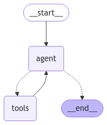
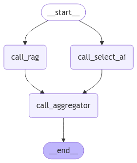
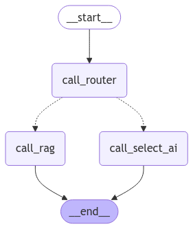
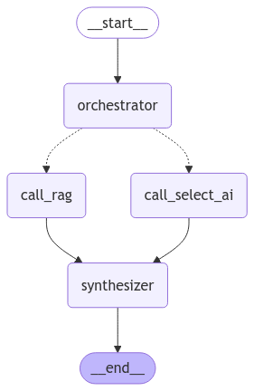
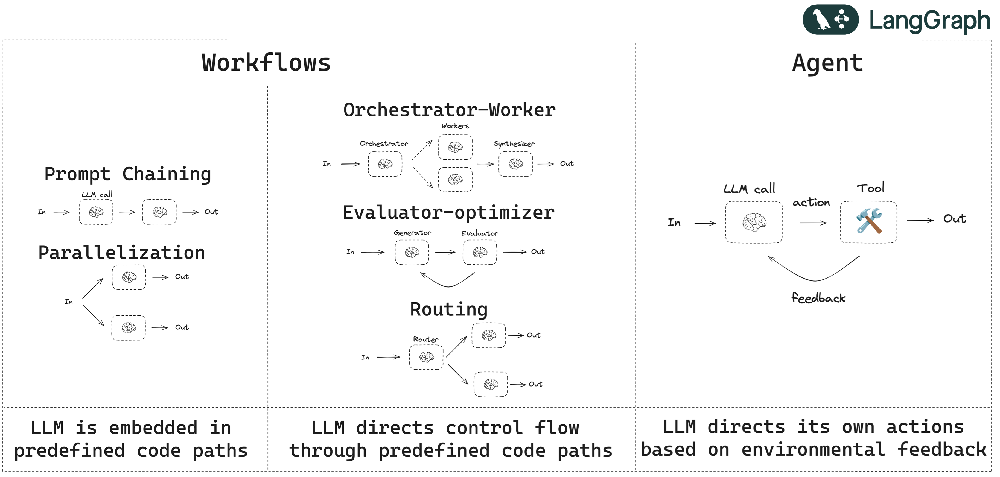
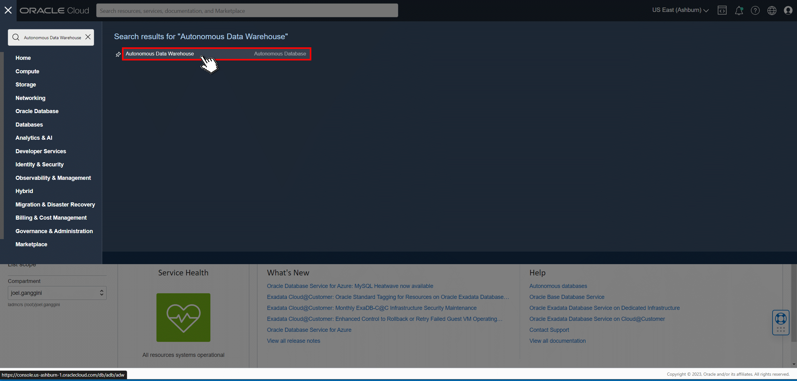
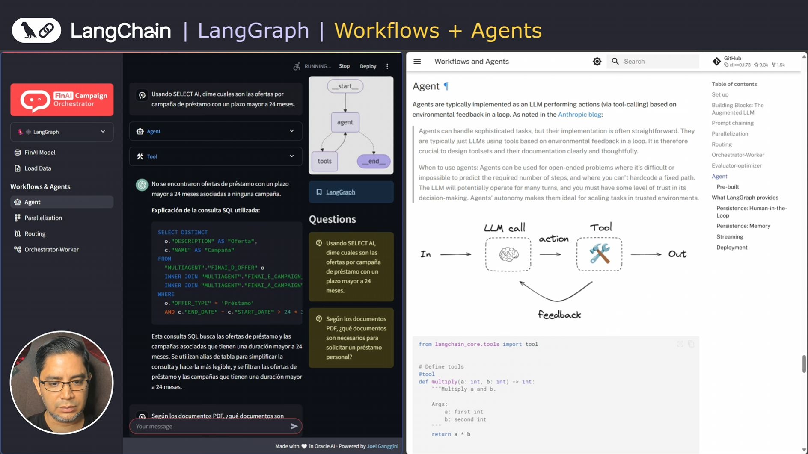

[![Issues][issues-shield]][issues-url]
[![LinkedIn][linkedin-shield]][linkedin-url]


<!-- Intro -->
<br />
<div align="center" style="text-align:center;">
  </img>
  <h1>🦜🕸️LangGraph</h1>

  <div align="center" style="text-align:center;">
    <table align="center">
      <tr style="font-size:medium;">
        <td colspan="1">Agent</td>
        <td colspan="1">Parallelization</td>
      </tr>
      <tr align="center">
        <td></td>
        <td></td>
      </tr>
      <tr style="font-size:medium;">
        <td colspan="1">Routing</td>
        <td colspan="1">Orchestation-Worker</td>
      </tr>
      <tr align="center">
        <td></td>
        <td></td>
      </tr>
      <tr style="font-size:medium;">
        <td colspan="2">Workflow + Agent</td>
      </tr>
      <tr align="center">
        <td colspan="2"></td>
      </tr>
    </table>
  </div>
  
  <a style="font-size:large;" href="/src/">👨🏽‍💻 Explore the Code »</a>
  <br/>
  <a href="https://www.youtube.com/watch?v=6L1YmTRZNxM&list=PLMUWTQHw13gbk738EGtr0fWwi40B81qEw">🎬 View Demo</a>
  ·
  <a href="https://github.com/jganggini/oci-functions/issues">💣 Report Bug</a>
  ·
  <a href="https://github.com/jganggini/oci-functions/pulls">🚀 Request Feature</a>
</div>

💼 𝗨𝘀𝗲 𝗖𝗮𝘀𝗲
Este caso de uso exploramos con FinAI Campaign Orchestrator, un sistema que combina SELECT AI y RAG (Retrieval-Augmented Generation) para responder consultas financieras de manera inteligente. En el sector bancario, la información se encuentra dispersa entre bases de datos estructuradas y documentos no estructurados, lo que dificulta el acceso rápido a datos clave sobre préstamos, campañas y políticas. Con Autonomous Database 23AI, podemos aprovechar consultas SQL generadas automáticamente por SELECT AI para extraer información precisa de tablas relacionales, mientras que RAG permite buscar respuestas en documentos PDF almacenados como vectores, asegurando una consulta más completa y efectiva.

Este enfoque abre múltiples posibilidades para la automatización en el análisis financiero. Con LangGraph, orquestamos agentes que pueden decidir en tiempo real si una pregunta debe resolverse mediante SQL o búsqueda en texto, optimizando el flujo de información. Esto permite a bancos y fintechs mejorar la toma de decisiones, evaluar campañas activas, filtrar ofertas de crédito y consultar políticas de préstamos sin necesidad de procesos manuales.

¡Descubre en este video cómo integrar estos agentes IA para revolucionar la gestión de datos en el sector financiero! 

Este documento describe los pasos necesarios para instalar y configurar el proyecto `Oracle AI LangGraph` disponible en [GitHub](https://github.com/jganggini/oracle-ai/tree/main/oracle-ai-langgraph).

Read More: [LangGraph](https://langchain-ai.github.io/langgraph/tutorials/workflows/).

## Requisitos Previos

### 1. Cuenta en Oracle Cloud Infrastructure (OCI)
Si no tiene una cuenta, regístrese en [Oracle Cloud](https://www.oracle.com/cloud/).

### 2. Servicios Necesarios

<div align="center" style="text-align:center;">
  <table align="center">
    <tr style="font-size:medium;">
      <td colspan="4">Oracle Cloud</td>
      <td colspan="4">GPU & Frameworks</td>
    </tr>
    <tr align="center" >
      <td></td>
      <td></td>
      <td></td>
      <td></td>
      <td></td>
      <td></td>
      <td></td>
    </tr>
    <tr style="font-size:small;">
      <td>Generative AI</td>
      <td>Autonomous 23ai</td>
      <td>Document <br/> Undestanding</td>
      <td>Speech</td>
      <td>NVidia</td>
      <td>Meta</td>
      <td>LangChain</td>
      <td>Streamlit</td>
    </tr>
  </table>
</div>

#### a) Autonomous Database
- Despliegue una instancia de Autonomous Database en OCI.

#### b) Object Storage Bucket
- Cree un bucket en OCI Object Storage.

#### c) Configurar Políticas de IAM
Se deben configurar las siguientes políticas para permitir el acceso adecuado:

###### c.1) OCI Document Understanding
```plaintext
Allow any-user to manage ai-service-document-family in tenancy
```
Read more: [About Document Understanding Policies](https://docs.oracle.com/en-us/iaas/Content/document-understanding/using/about_document-understanding_policies.htm).

###### c.2) OCI Generative AI
```plaintext
Allow any-user to manage generative-ai-family in tenancy
```
Read more: [Getting Access to Generative AI](https://docs.oracle.com/en-us/iaas/Content/generative-ai/iam-policies.htm).

###### c.3) Bucket
```plaintext
Allow any-user to read buckets in tenancy
Allow any-user to manage object-family in tenancy
Allow any-user to read objectstorage-namespaces in tenancy
```

### 3. Requisitos de la Máquina Local
- **Sistema Operativo:** Windows o macOS.
- **Anaconda (Conda):** Descargue e instale desde [Anaconda](https://www.anaconda.com/products/distribution).
- **Git:** Descargue e instale [Git](https://git-scm.com/).

## Instalación del Proyecto

### 1. Clonar el Repositorio
Ejecute en la terminal:
```bash
git clone https://github.com/jganggini/oracle-ai.git
```
O descargue el ZIP del repositorio y extraiga su contenido.

### 2. Crear Estructura de Carpetas
- **Windows:**
  ```bash
  mkdir C:\oracle-ai\oracle-ai-langgraph
  ```
- **macOS:**
  ```bash
  mkdir -p ~/oracle-ai/oracle-ai-langgraph
  ```
- Copie el contenido del repositorio clonado a esta carpeta.

### 3. Configurar el Wallet de Autonomous Database
- Descargue el Wallet desde la consola de OCI.

<p align="left">
  
</p>

- Coloque el archivo en:
  ```plaintext
  oracle-ai-langgraph/app/wallet
  ```

### 4. Generar API Key y Configurar la Carpeta .oci
#### a) Generar la API Key

- En OCI, agregue la clave `key.pem` en **User Settings -> API Keys**.

<p align="left">
  
</p>

#### b) Crear el Archivo de Configuración en `.oci`
- **Windows:**
  ```bash
  mkdir C:\Users\<su_usuario>\.oci
  ```
- **macOS:**
  ```bash
  mkdir ~/.oci
  ```
- Cree el archivo `config` en `.oci` con:
  ```plaintext
  [DEFAULT]
  user=<user_ocid>
  fingerprint=<fingerprint>
  key_file=~/.oci/key.pem
  tenancy=<tenancy_ocid>
  region=<region>
  ```

Cuando usas el archivo de configuración (config) de OCI, el parámetro region define la región predeterminada para tus operaciones. Para acceder a un bucket en Object Storage, debes asegurarte de estar apuntando a la misma región donde se encuentra ese bucket. Si tu config especifica, por ejemplo, region = `us-ashburn-1`, pero tu bucket está creado en `us-phoenix-1`, tendrás que:

- Cambiar la región en el archivo config a `us-phoenix-1`, o
- Crear un perfil adicional en ese mismo archivo con la región correcta, o
- Sobrescribir la región a través de un parámetro/flag en la CLI o variable de entorno cuando ejecutes los comandos.

En otras palabras, el valor de region en el config determina a qué región se dirigirán tus comandos por defecto. Si tu bucket está en otra región, no podrás manejarlo usando el perfil que apunte a la región equivocada; deberás indicar la región correcta de alguna de las formas mencionadas.

### 5. Configurar Variables de Entorno
Edite el archivo `.env` ubicado en `oracle-ai-langgraph/app/.env` y agregue los valores necesarios.

### 6. Instalar Dependencias y Ejecutar el Proyecto
Ejecute:
```bash
cd oracle-ai-langgraph
python setup.py
```

### 7. Ejecion Manual
#### **Windows:**
```bash
cd app
conda activate <env_name>
streamlit run app.py --server.port 8501
```

#### **macOS:**
```bash
cd app
source activate <env_name>
streamlit run app.py --server.port 8501
```

## Nota
Siguiendo estos pasos, el entorno estará listo para ejecutar las 5 demos de AI en Oracle Cloud.

## Video

<p align="left">
  <a href="https://youtu.be/FLisHRFT1Xg?si=43UdfxK08F9GWoje">
    
  </a>
</p>

<!-- MARKDOWN LINKS & IMAGES -->
<!-- https://www.markdownguide.org/basic-syntax/#reference-style-links -->
[issues-shield]: https://img.shields.io/github/issues/othneildrew/Best-README-Template.svg?style=for-the-badge
[issues-url]: https://github.com/jganggini/oci-functions/issues
[linkedin-shield]: https://img.shields.io/badge/-LinkedIn-black.svg?style=for-the-badge&logo=linkedin&colorB=555
[linkedin-url]: https://www.linkedin.com/in/jganggini/