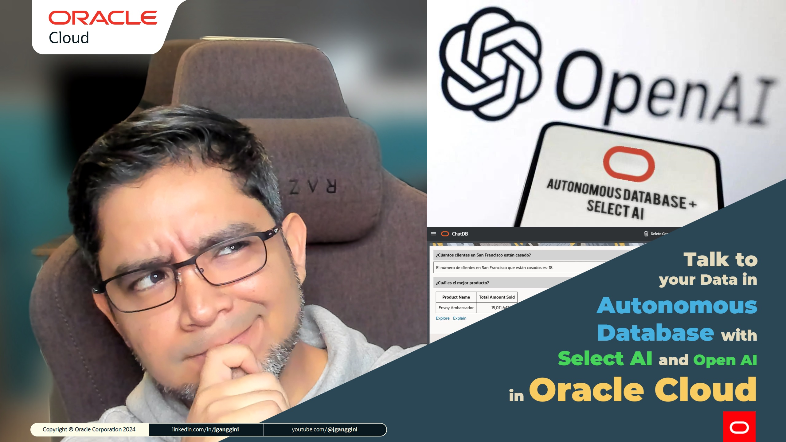
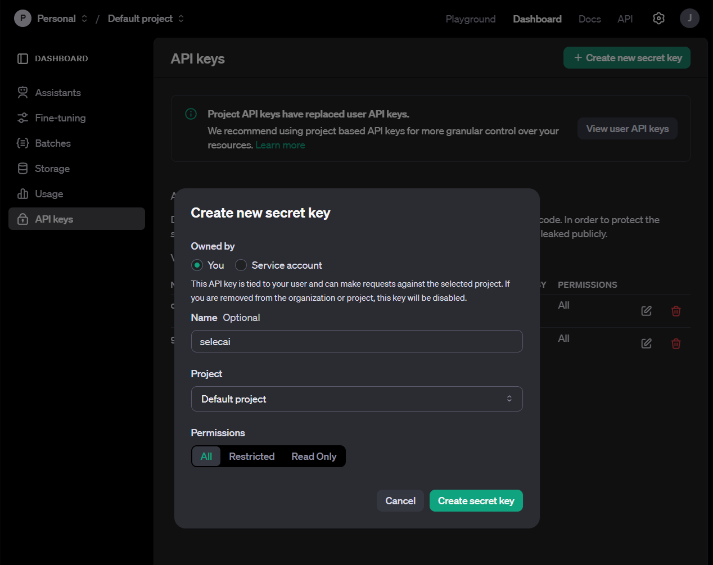

[![Issues][issues-shield]][issues-url]
[![LinkedIn][linkedin-shield]][linkedin-url]


<!-- PROJECT LOGO -->
<br />
<p align="center">

  <h2 align="center">Autonomous DB with <br>Select AI & Open AI<br> in Oracle Cloud</h3>

  <p align="center">
    <a href="https://youtube.com/@jganggini">🎬 View Demo</a>
    ·
    <a href="https://github.com/jganggini/oracle-ai/issues">Report Bug</a>
    ·
    <a href="https://github.com/jganggini/oracle-ai/pulls">Request Feature</a>
  </p>
</p>

## Introducción

Este documento describe cómo configurar Oracle Autonomous Database para interactuar con OpenAI API, utilizando los paquetes `DBMS_NETWORK_ACL_ADMIN`, `DBMS_CLOUD`, y `DBMS_CLOUD_AI`.



### Pasos de Configuración

### `Paso 1`: Ingresar o Crear Autonomous Database. Ejecutar con usuario Administrador (ADMIN)

1. Crear el usuario `DEMO`

    ```sql
    CREATE USER DEMO
        IDENTIFIED BY Ag8bt25atLuQj
        DEFAULT TABLESPACE tablespace
        QUOTA UNLIMITED ON tablespace;
    /
    ```

2. Autonomous Database vienen con un `ROL` predefinido llamado `DWROLE` que proporciona privilegios comunes para los usuarios. Para este caso se debe otorgar privilegios de forma individual al usuarios `DEMO`.

    ```sql
    GRANT DWROLE TO DEMO;
    /
    ```

3. El paquete `DBMS_NETWORK_ACL_ADMIN` proporciona la interfaz para administrar la lista de control de acceso (ACL) de la red. En este caso se da acceso de red para conectarnos a cualquier api.

    ```sql
    BEGIN  
        DBMS_NETWORK_ACL_ADMIN.APPEND_HOST_ACE(
            host => '*',
            ace  => xs$ace_type(
                    privilege_list => xs$name_list('http'),
                    principal_name => 'DEMO',
                    principal_type => xs_acl.ptype_db)
        );
    END;
    /
    /
    ```

4. Crear el usuario `DEMO` y darle privilegios para ejecutar `DBMS_CLOUD` y `DBMS_CLOUD_AI`

    ```sql
    GRANT EXECUTE ON DBMS_CLOUD TO DEMO;
    GRANT EXECUTE ON DBMS_CLOUD_AI TO DEMO;
    /
    ```

### `Paso 2`: Ejecutar con usuario Administrador (DEMO)

2. Crear una nueva credencial para OpenAI:

    ```sql
    BEGIN
        DBMS_CLOUD.CREATE_CREDENTIAL(
            credential_name => 'OPENAI_CRED',
            username => 'OPENAI',
            password => 'sk-proj-*********' );
    END;
    /
    ```

    Para generar el Secret Key, se debe de crear una cuenta en OpenAI y seleccionar `Create new secret key` [api-keys](https://platform.openai.com/api-keys)

    

4. Crear un perfil nuevo para `OPENAI`:

    ```sql
    BEGIN
        DBMS_CLOUD_AI.create_profile(
            profile_name => 'OPENAI',
            attributes => '{
                "provider": "openai",
                "model": "gpt-4o",
                "credential_name": "OPENAI_CRED",
                "object_list": [
                    {"owner": "SH", "name": "customers"},
                    {"owner": "SH", "name": "sales"},
                    {"owner": "SH", "name": "products"},
                    {"owner": "SH", "name": "countries"}
                ]
            }');
    END;
    /
    ```

5. Establecer el perfil creado como el perfil activo:

    ```sql
    BEGIN
        DBMS_CLOUD_AI.SET_PROFILE(
            profile_name => 'OPENAI'
        );
    END;
    /
    ```
6. [Opcional], si es que existe la credencial y perfil, puede eliminarlos.

    ```sql
    BEGIN
        DBMS_CLOUD.DROP_CREDENTIAL (
            credential_name  => 'OPENAI_CRED');
    END;
    /

    BEGIN
        DBMS_CLOUD_AI.drop_profile(profile_name => 'OPENAI');
    END;
    /
    ```

### `Paso 3`: Ejemplos de Uso

1. Generar una narración sobre los clientes en San Francisco que están casados:

    ```sql
    SELECT DBMS_CLOUD_AI.GENERATE(
        prompt => '¿Cúantos clientes en San Francisco están casado?',
        profile_name => 'OPENAI',
        action => 'narrate') AS chat
    FROM dual;
    ```

2. Generar la consulta SQL correspondiente para encontrar clientes casados en San Francisco:

    ```sql
    SELECT DBMS_CLOUD_AI.GENERATE(
        prompt => '¿Cúantos clientes en San Francisco están casado?',
        profile_name => 'OPENAI',
        action => 'showsql') AS query
    FROM dual;
    ```

3. Generar una narración sobre cuál es el mejor producto:*

    ```sql
    SELECT DBMS_CLOUD_AI.GENERATE(
        prompt => '¿Cuál es el mejor producto?',
        profile_name => 'OPENAI',
        action => 'narrate')
    FROM dual;
    ```

### `Paso 4`: APEX

1. Para integrarlo con Apex es necesario realizar los pasos anteriores e importar el archivo [apex-chat-select-ai-spanish.sql](apex/apex-chat-select-ai-spanish.zip)

### Recursos

- [Documentación de Oracle Autonomous Database: DBMS_CLOUD_AI Package](https://docs.oracle.com/en/cloud/paas/autonomous-database/serverless/adbsb/dbms-cloud-ai-package.html#GUID-12D91681-B51C-48E0-93FD-9ABC67B0F375)
- [OpenAI API Playground](https://platform.openai.com/playground/chat)

<!-- Contacto -->
## Contacto
Project Link: [https://github.com/jganggini](https://github.com/jganggini)

<!-- MARKDOWN LINKS & IMAGES -->
<!-- https://www.markdownguide.org/basic-syntax/#reference-style-links -->
[issues-shield]: https://img.shields.io/github/issues/othneildrew/Best-README-Template.svg?style=for-the-badge
[issues-url]: https://github.com/jganggini/oci-functions/issues
[linkedin-shield]: https://img.shields.io/badge/-LinkedIn-black.svg?style=for-the-badge&logo=linkedin&colorB=555
[linkedin-url]: https://www.linkedin.com/in/jganggini/